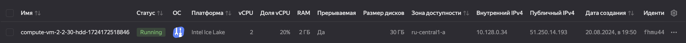

# Домашнее задание к занятию 1.  «Введение в виртуализацию»

#### Это задание для самостоятельной отработки навыков и не предполагает обратной связи от преподавателя. Его выполнение не влияет на завершение модуля. Но мы рекомендуем его выполнить, чтобы закрепить полученные знания.  Все вопросы, возникающие в процессе выполнения заданий, пишите в учебный чат или в раздел "Вопросы по заданиям" в личном кабинете.

### Цели задания
1. Научиться запускать виртуальную машину в Yandex Cloud с минимальным расходом ресурсов.
2. Попрактиковаться в выборе платформы  и системы управления виртуализации для решения требуемых задач.

### Инструкция к выполению

1. Для выполнения задачи 1 ознакомьтесь с [инструкцией](https://github.com/netology-code/devops-materials/blob/master/cloudwork.MD) по экономии облачных ресурсов и затем выполните задачу 1 по шагам.
2. Своё решение к задачам 2,3,4 загрузите  в ваш ЛК.
   
## Задача 1

Ознакомьтесь с [инструкцией ](https://github.com/netology-code/devops-materials/blob/master/cloudwork.MD) по экономии облачных ресурсов.


1. Создайте через web-интерфейс Yandex Cloud - VPC и виртуальную машину из инструкции конфигурации "эконом-ВМ" с публичным ip-адресом. В пункте "Выбор образа/загрузочного диска" выберите вкладку "Cloud Marketplace" , щелкните "Посмотреть больше", найдите образ "Yandex Cloud Toolbox".
    
2. Убедитесь, что вы можете подключиться к консоли ВМ через ssh, используя публичный ip-адрес. Убедитесь, что на ВМ установлен Docker с помощью команды ```docker --version```(команду выполните от имени root пользователя) !
    ```
    Last login: Tue Aug 20 19:53:49 on ttys001
    alekseykashin@MacBook-Pro-Aleksej ~ % ssh red0c@51.250.14.193                  
    Welcome to Ubuntu 22.04.2 LTS (GNU/Linux 5.15.0-73-generic x86_64)

    * Documentation:  https://help.ubuntu.com
    * Management:     https://landscape.canonical.com
    * Support:        https://ubuntu.com/advantage

    System information as of Tue Aug 20 07:54:36 PM MSK 2024

    System load:  0.046875           Processes:                138
    Usage of /:   22.1% of 29.44GB   Users logged in:          0
    Memory usage: 12%                IPv4 address for docker0: 172.17.0.1
    Swap usage:   0%                 IPv4 address for eth0:    10.128.0.34


    Expanded Security Maintenance for Applications is not enabled.

    0 updates can be applied immediately.

    Enable ESM Apps to receive additional future security updates.
    See https://ubuntu.com/esm or run: sudo pro status


    The list of available updates is more than a week old.
    To check for new updates run: sudo apt update

    Last login: Tue Aug 20 19:52:37 2024 from 188.162.54.141
    red0c@compute-vm-2-2-30-hdd-1724172518846:~$ docker --version
    Docker version 20.10.21, build 20.10.21-0ubuntu1~22.04.3
    red0c@compute-vm-2-2-30-hdd-1724172518846:~$ 
    ```
3. Узнайте в инструкции Яндекс, какие еще инструменты предустановлены в данном образе.
    ``` 
    Образ на базе Ubuntu 22.04 LTS, в котором собраны следующие инструменты для управления ресурсами Yandex Cloud:
        интерфейс командной строки Yandex Cloud;
        Terraform — инструмент для управления облачной инфраструктурой от компании Hashicorp;
        Packer — инструмент для сборки образов виртуальных машин от компании Hashicorp;
        Pulumi — инструмент для управления облачной инфраструктурой с использованием традиционных языков программирования;
        Helm — менеджер пакетов для Kubernetes;
        kubectl — инструмент командной строки для управления кластерами Kubernetes;
        gRPCurl — инструмент командной строки для взаимодействия с серверами gRPC;
        jq — JSON-процессор командной строки;
        yq — YAML-, JSON- и XML-процессор командной строки;
        Docker — платформа для разработки контейнерных приложений;
        Git — система контроля версий;
        tree — утилита для просмотра дерева директорий;
        tmux — терминальный мультиплексор.

    Состав продукта:
        ПО	Версия
        Ubuntu	22.04
        Docker	20.10.21
        Terraform	1.4.6
        YC CLI	0.106.0
        AWS CLI	2.11.27
        Helm	3.12.0
        Pulumi	3.70.0
        git	2.34.1
        grpcurl	1.8.7
        jq	1.6
        tree	2.0.2
        Packer	1.9.1
        yq	4.34.1
    ```
4. Оставьте ВМ работать, пока она не выключится самостоятельно! Опция "прерываемая" выключит ее не позже чем через 24 часа. 
5. Для наглядности подождите еще 1 сутки.
6. Перейдите по [ссылке ](https://console.cloud.yandex.ru/billing?section=accounts). Выберите свой платежный аккаунт. Перейдите на вкладку детализация (фильтр "По продуктам") и оцените график потребления финансов.
7. Удалите ВМ или пользуйтесь ею при выполнении последующих домашних заданий курса обучения.

---


## Задача 2

Выберите один из вариантов платформы в зависимости от задачи. Здесь нет однозначно верного ответа так как все зависит от конкретных условий: финансирование, компетенции специалистов, удобство использования, надежность, требования ИБ и законодательства, фазы луны.

Тип платформы:

- физические сервера;
- паравиртуализация;
- виртуализация уровня ОС;

Задачи:

- высоконагруженная база данных MySql, критичная к отказу;
    > физические сервера
- различные web-приложения;
    > виртуализация уровня ОС
- Windows-системы для использования бухгалтерским отделом;
    > паравиртуализация
- системы, выполняющие высокопроизводительные расчёты на GPU.
    > виртуализация уровня ОС

Объясните критерии выбора платформы в каждом случае.

## Задача 3

Выберите подходящую систему управления виртуализацией для предложенного сценария. Опишите ваш выбор.

Сценарии:

1. 100 виртуальных машин на базе Linux и Windows, общие задачи, нет особых требований. Преимущественно Windows based-инфраструктура, требуется реализация программных балансировщиков нагрузки, репликации данных и автоматизированного механизма создания резервных копий.
> Citrix | VMware ESXi (хорошо подхоят для корпоративного применения, иимеют все выше перечисленное)
2. Требуется наиболее производительное бесплатное open source-решение для виртуализации небольшой (20-30 серверов) инфраструктуры на базе Linux и Windows виртуальных машин.
> Proxmox VE | Xen (open-source решение которое может работать с разными OS)
3. Необходимо бесплатное, максимально совместимое и производительное решение для виртуализации Windows-инфраструктуры.
> Hyper-V (тесно интегрирован в операционную систему Windows Server и в экосистему корпорации Microsoft в целом. Если купили Windows Server, значит купили и Hyper-V)
4. Необходимо рабочее окружение для тестирования программного продукта на нескольких дистрибутивах Linux.
> VirtualBox (для быстрого разворачивания на своей локальной машине)

## Задача 4

Опишите возможные проблемы и недостатки гетерогенной среды виртуализации (использования нескольких систем управления виртуализацией одновременно) и что необходимо сделать для минимизации этих рисков и проблем. Если бы у вас был выбор, создавали бы вы гетерогенную среду или нет?

> Гетерогенные виртуальные среды также могут быть неэффективны и сложны в управлении. Такой подход подразумевает, что определенные типы устройств выполняют соответственные задачи, и при этом компания зависит от продукции не одного вендора. Для управления таким требуется целый набор специалистов различного профиля, разнородность директорий хранения данных и произвольное расположение виртуальных машин в инфраструктуре значительно усложняет задачу управления огромными объемами динамических данных. Эта проблема особенно ощутима, когда компании необходимо будет обеспечить оперативную миграцию данных и виртуальных машин между виртуальными и физическими средами.

### Правила приема

Домашнее задание выполните в файле readme.md в GitHub-репозитории. В личном кабинете отправьте на проверку ссылку на .md-файл в вашем репозитории.
