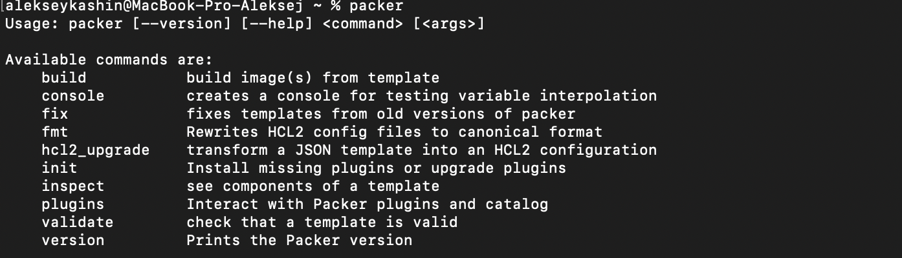
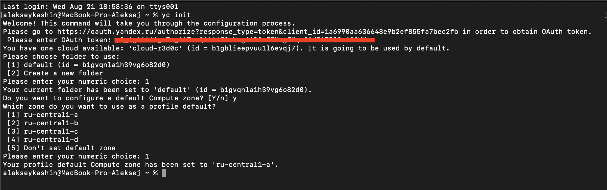
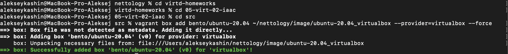
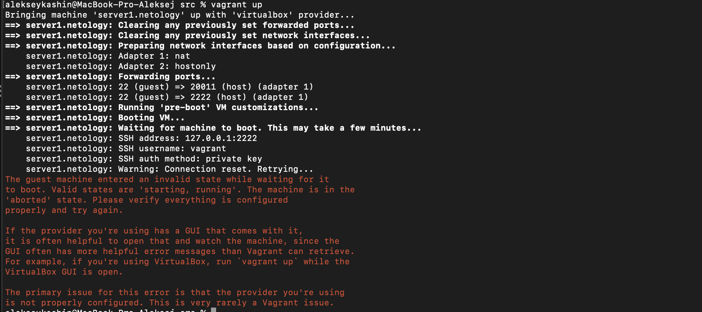
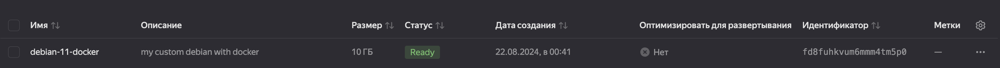
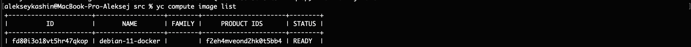
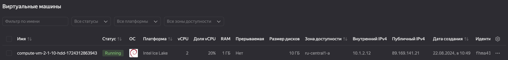

# Домашнее задание к занятию 2. «Применение принципов IaaC в работе с виртуальными машинами»

#### Это задание для самостоятельной отработки навыков и не предполагает обратной связи от преподавателя. Его выполнение не влияет на завершение модуля. Но мы рекомендуем его выполнить, чтобы закрепить полученные знания. Все вопросы, возникающие в процессе выполнения заданий, пишите в учебный чат или в раздел "Вопросы по заданиям" в личном кабинете.
---
## Важно

**Перед началом работы над заданием изучите [Инструкцию по экономии облачных ресурсов](https://github.com/netology-code/devops-materials/blob/master/cloudwork.MD).**
Перед отправкой работы на проверку удаляйте неиспользуемые ресурсы.
Это нужно, чтобы не расходовать средства, полученные в результате использования промокода.
Подробные рекомендации [здесь](https://github.com/netology-code/virt-homeworks/blob/virt-11/r/README.md).

---

### Цели задания

1. Научиться создвать виртуальные машины в Virtualbox с помощью Vagrant.
2. Научиться базовому использованию packer в yandex cloud.

   
## Задача 1
Установите на личный Linux-компьютер или учебную **локальную** ВМ с Linux следующие сервисы(желательно ОС ubuntu 20.04):

- [VirtualBox](https://www.virtualbox.org/),
- [Vagrant](https://github.com/netology-code/devops-materials), рекомендуем версию 2.3.4
> 
- [Packer](https://github.com/netology-code/devops-materials/blob/master/README.md) версии 1.9.х + плагин от Яндекс Облако по [инструкции](https://cloud.yandex.ru/docs/tutorials/infrastructure-management/packer-quickstart)
> 
- [уandex cloud cli](https://cloud.yandex.com/ru/docs/cli/quickstart) Так же инициализируйте профиль с помощью ```yc init``` .
> 


Примечание: Облачная ВМ с Linux в данной задаче не подойдёт из-за ограничений облачного провайдера. У вас просто не установится virtualbox.

## Задача 2

1. Убедитесь, что у вас есть ssh ключ в ОС или создайте его с помощью команды ```ssh-keygen -t ed25519```
2. Создайте виртуальную машину Virtualbox с помощью Vagrant и  [Vagrantfile](https://github.com/netology-code/virtd-homeworks/blob/shvirtd-1/05-virt-02-iaac/src/Vagrantfile) в директории src.
3. Зайдите внутрь ВМ и убедитесь, что Docker установлен с помощью команды:
```
docker version && docker compose version
```

3. Если Vagrant выдаёт ошибку (блокировка трафика):
```
URL: ["https://vagrantcloud.com/bento/ubuntu-20.04"]     
Error: The requested URL returned error: 404:
```

Выполните следующие действия:

- Скачайте с [сайта](https://app.vagrantup.com/bento/boxes/ubuntu-20.04) файл-образ "bento/ubuntu-20.04".
- Добавьте его в список образов Vagrant: "vagrant box add bento/ubuntu-20.04 <путь к файлу>".


**Важно:**    
- Если ваша хостовая рабочая станция - это windows ОС, то у вас могут возникнуть проблемы со вложенной виртуализацией. Ознакомиться со cпособами решения можно [по ссылке](https://www.comss.ru/page.php?id=7726).

- Если вы устанавливали hyper-v или docker desktop, то  все равно может возникать ошибка:  
`Stderr: VBoxManage: error: AMD-V VT-X is not available (VERR_SVM_NO_SVM)`   
 Попробуйте в этом случае выполнить в Windows от администратора команду `bcdedit /set hypervisorlaunchtype off` и перезагрузиться.

- Если ваша рабочая станция в меру различных факторов не может запустить вложенную виртуализацию - допускается неполное выполнение(до ошибки запуска ВМ)

> 

## Задача 3

   ```
   alekseykashin@MacBook-Pro-Aleksej src % yc vpc network create --name net --labels my-label=netology --description "network for test"
   id: enpfstrcdenn2bv0kcik
   folder_id: b1gvqnla1h39vg6o82d0
   created_at: "2024-08-21T20:33:59Z"
   name: net
   description: network for test
   labels:
   my-label: netology
   default_security_group_id: enpigktro58caj0vrtad

   alekseykashin@MacBook-Pro-Aleksej src % yc vpc subnet create --name my-subnet-a --zone ru-central1-a --range 10.1.2.0/24 --network-name net --description "subnet for test"
   id: e9bnagv2cirafgimitcr
   folder_id: b1gvqnla1h39vg6o82d0
   created_at: "2024-08-21T20:38:04Z"
   name: my-subnet-a
   description: subnet for test
   network_id: enpfstrcdenn2bv0kcik
   zone_id: ru-central1-a
   v4_cidr_blocks:
   - 10.1.2.0/24
   ```

1. Отредактируйте файл    [mydebian.json.pkr.hcl](https://github.com/netology-code/virtd-homeworks/blob/shvirtd-1/05-virt-02-iaac/src/mydebian.json.pkr.hcl)  или [mydebian.jsonl](https://github.com/netology-code/virtd-homeworks/blob/shvirtd-1/05-virt-02-iaac/src/mydebian.json) в директории src (packer умеет и в json, и в hcl форматы):
   - добавьте в скрипт установку docker. Возьмите скрипт установки для debian из  [документации](https://docs.docker.com/engine/install/debian/)  к docker, 
   - дополнительно установите в данном образе htop и tmux.(не забудьте про ключ автоматического подтверждения установки для apt)
   ```
   alekseykashin@MacBook-Pro-Aleksej src % packer validate mydebian.json
   The configuration is valid.
   alekseykashin@MacBook-Pro-Aleksej src % packer build mydebian.json
   yandex: output will be in this color.

   ==> yandex: Creating temporary RSA SSH key for instance...
   ==> yandex: Using as source image: fd8lk4dibrqmhmn8rbc4 (name: "debian-11-v20240812", family: "debian-11")
   ==> yandex: Use provided subnet id e9bnagv2cirafgimitcr
   ==> yandex: Creating disk...
   ==> yandex: Creating instance...
   ==> yandex: Waiting for instance with id fhmcv9g7bhu81vdhunjq to become active...
      yandex: Detected instance IP: 89.169.143.167
   ==> yandex: Using SSH communicator to connect: 89.169.143.167
   ==> yandex: Waiting for SSH to become available...
   ==> yandex: Connected to SSH!
   ==> yandex: Provisioning with shell script: /var/folders/b6/gxcyvn9s2xbdldy5nq1ts_r00000gn/T/packer-shell2598073341
      yandex: hello from packer
      yandex: Get:1 http://mirror.yandex.ru/debian bullseye InRelease [116 kB]
      yandex: Get:2 http://mirror.yandex.ru/debian bullseye-updates InRelease [44.1 kB]
      yandex: Get:3 http://mirror.yandex.ru/debian bullseye-backports InRelease [49.0 kB]
      yandex: Get:4 http://security.debian.org bullseye-security InRelease [48.4 kB]
      yandex: Get:5 http://mirror.yandex.ru/debian bullseye/main Sources [8,502 kB]
      yandex: Get:6 http://mirror.yandex.ru/debian bullseye/main amd64 Packages [8,067 kB]
      yandex: Get:7 http://mirror.yandex.ru/debian bullseye/main Translation-en [6,236 kB]
      yandex: Get:8 http://security.debian.org bullseye-security/main Sources [186 kB]
      yandex: Get:9 http://mirror.yandex.ru/debian bullseye/main amd64 Contents (deb) [10.3 MB]
      yandex: Get:10 http://security.debian.org bullseye-security/main amd64 Packages [280 kB]
      yandex: Get:11 http://security.debian.org bullseye-security/main Translation-en [181 kB]
      yandex: Get:12 http://mirror.yandex.ru/debian bullseye/main all Contents (deb) [31.3 MB]
      yandex: Get:13 http://mirror.yandex.ru/debian bullseye-updates/main Sources [7,908 B]
      yandex: Get:14 http://mirror.yandex.ru/debian bullseye-updates/main amd64 Packages [18.8 kB]
      yandex: Get:15 http://mirror.yandex.ru/debian bullseye-updates/main Translation-en [10.9 kB]
      yandex: Get:16 http://mirror.yandex.ru/debian bullseye-updates/main amd64 Contents (deb) [88.3 kB]
      yandex: Get:17 http://mirror.yandex.ru/debian bullseye-updates/main all Contents (deb) [27.3 kB]
      yandex: Get:18 http://mirror.yandex.ru/debian bullseye-backports/main Sources [376 kB]
      yandex: Get:19 http://mirror.yandex.ru/debian bullseye-backports/main amd64 Packages [403 kB]
      yandex: Get:20 http://mirror.yandex.ru/debian bullseye-backports/main Translation-en [344 kB]
      yandex: Get:21 http://mirror.yandex.ru/debian bullseye-backports/main all Contents (deb) [4,672 kB]
      yandex: Get:22 http://mirror.yandex.ru/debian bullseye-backports/main amd64 Contents (deb) [1,133 kB]
      yandex: Fetched 72.4 MB in 10s (7,376 kB/s)
      yandex: Reading package lists...
      yandex: Reading package lists...
      yandex: Building dependency tree...
      yandex: Reading state information...
      yandex: ca-certificates is already the newest version (20210119).
      yandex: ca-certificates set to manually installed.
      yandex: curl is already the newest version (7.74.0-1.3+deb11u12).
      yandex: 0 upgraded, 0 newly installed, 0 to remove and 1 not upgraded.
      yandex: Hit:1 http://mirror.yandex.ru/debian bullseye InRelease
      yandex: Hit:2 http://mirror.yandex.ru/debian bullseye-updates InRelease
      yandex: Hit:3 http://mirror.yandex.ru/debian bullseye-backports InRelease
      yandex: Hit:4 http://security.debian.org bullseye-security InRelease
      yandex: Get:5 https://download.docker.com/linux/debian bullseye InRelease [43.3 kB]
      yandex: Get:6 https://download.docker.com/linux/debian bullseye/stable amd64 Packages [42.9 kB]
      yandex: Get:7 https://download.docker.com/linux/debian bullseye/stable amd64 Contents (deb) [1,345 B]
      yandex: Fetched 87.6 kB in 1s (170 kB/s)
      yandex: Reading package lists...
   ==> yandex: Stopping instance...
   ==> yandex: Deleting instance...
      yandex: Instance has been deleted!
   ==> yandex: Creating image: debian-11-docker
   ==> yandex: Waiting for image to complete...
   ==> yandex: Success image create...
   ==> yandex: Destroying boot disk...
      yandex: Disk has been deleted!
   Build 'yandex' finished after 2 minutes 39 seconds.

   ==> Wait completed after 2 minutes 39 seconds

   ==> Builds finished. The artifacts of successful builds are:
   --> yandex: A disk image was created: debian-11-docker (id: fd8fuhkvum6mmm4tm5p0) with family name 
   ```
3. Найдите свой образ в web консоли yandex_cloud
   > 
4. Необязательное задание(*): найдите в документации yandex cloud как найти свой образ с помощью утилиты командной строки "yc cli".
   > 
5. Создайте новую ВМ (минимальные параметры) в облаке, используя данный образ.
   > 
6. Подключитесь по ssh и убедитесь в наличии установленного docker.
   ```
   alekseykashin@MacBook-Pro-Aleksej src % ssh red0c@89.169.141.21
   The authenticity of host '89.169.141.21 (89.169.141.21)' can't be established.
   ED25519 key fingerprint is SHA256:JqpwyuE76NFfsbKrVk0sX5N6LKOyroKHxgjIR+jFkHk.
   This key is not known by any other names.
   Are you sure you want to continue connecting (yes/no/[fingerprint])? yes 
   Warning: Permanently added '89.169.141.21' (ED25519) to the list of known hosts.
   Linux compute-vm-2-1-10-hdd-1724312863943 5.10.0-19-amd64 #1 SMP Debian 5.10.149-2 (2022-10-21) x86_64

   The programs included with the Debian GNU/Linux system are free software;
   the exact distribution terms for each program are described in the
   individual files in /usr/share/doc/*/copyright.

   Debian GNU/Linux comes with ABSOLUTELY NO WARRANTY, to the extent
   permitted by applicable law.
   red0c@compute-vm-2-1-10-hdd-1724312863943:~$ 
   ```
7. Удалите ВМ и образ.
8. **ВНИМАНИЕ!** Никогда не выкладываете oauth token от облака в git-репозиторий! Утечка секретного токена может привести к финансовым потерям. После выполнения задания обязательно удалите секретные данные из файла mydebian.json и mydebian.json.pkr.hcl. (замените содержимое токена на  "ххххх")
9. В качестве ответа на задание  загрузите результирующий файл в ваш ЛК.
