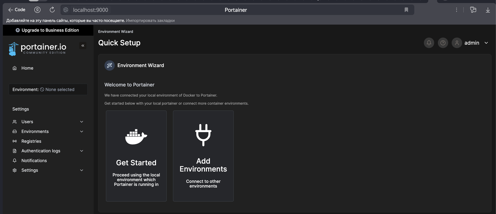
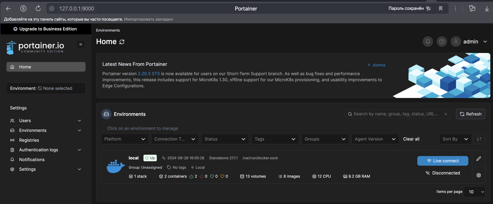
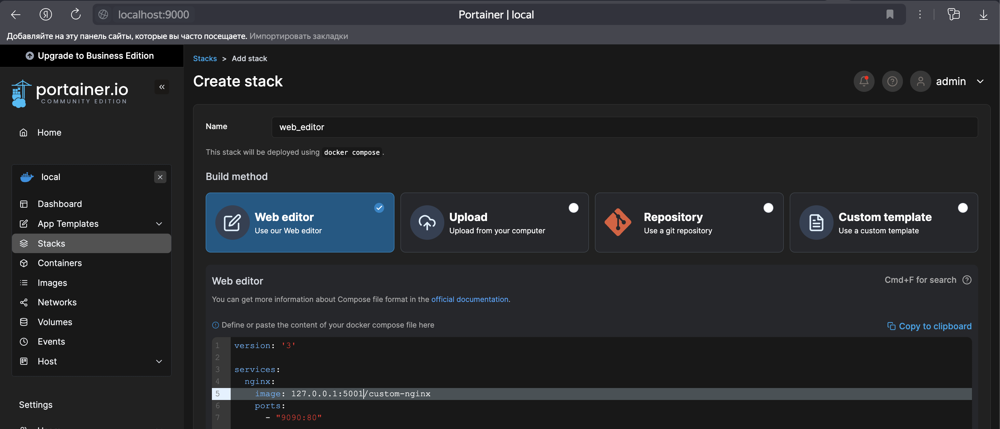
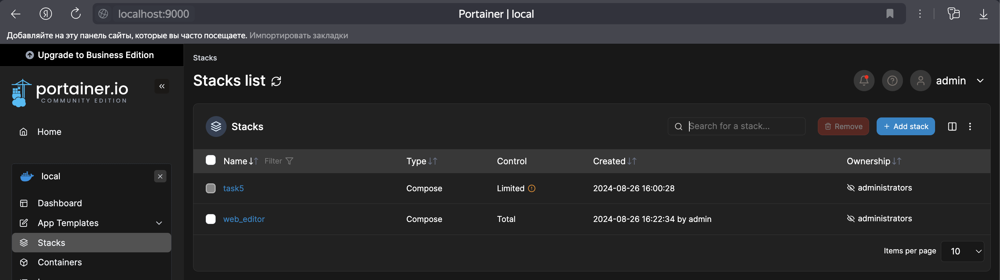
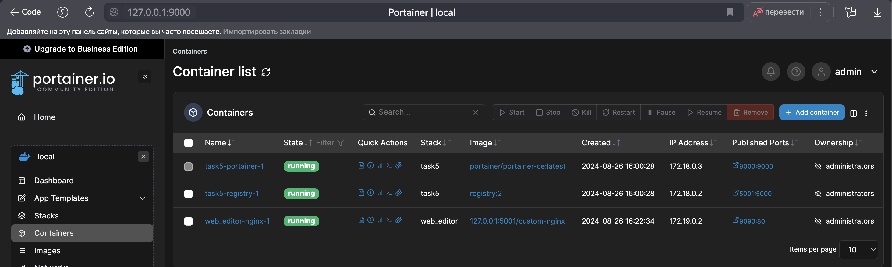
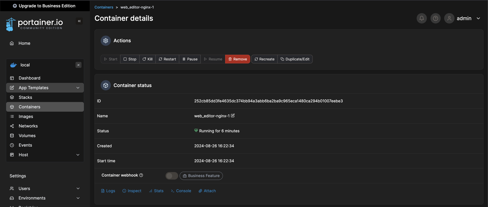
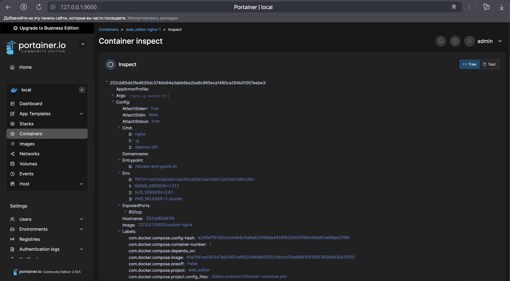
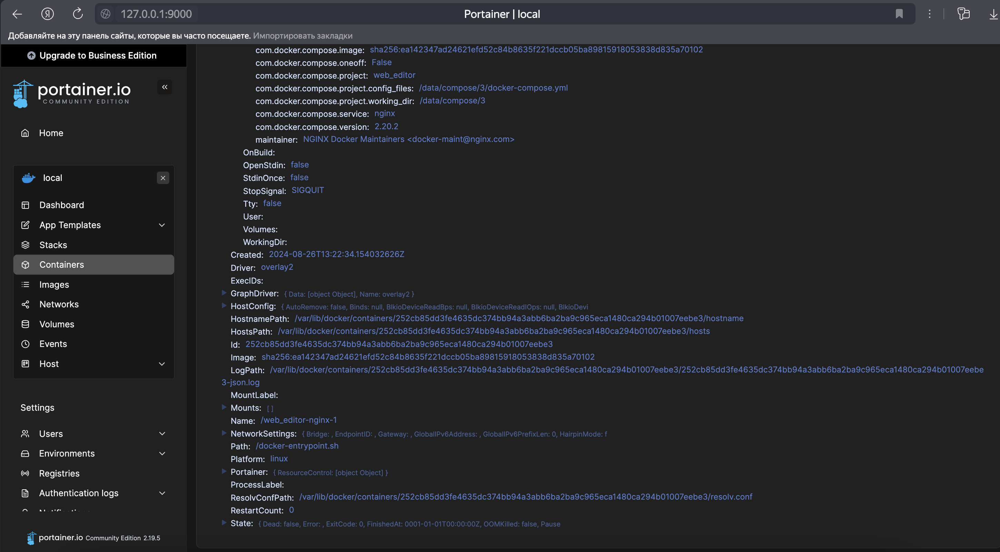

# Домашнее задание к занятию 4 «Оркестрация группой Docker контейнеров на примере Docker Compose»

### Инструкция к выполению

1. Для выполнения заданий обязательно ознакомьтесь с [инструкцией](https://github.com/netology-code/devops-materials/blob/master/cloudwork.MD) по экономии облачных ресурсов. Это нужно, чтобы не расходовать средства, полученные в результате использования промокода.
2. Практические задачи выполняйте на личной рабочей станции или созданной вами ранее ВМ в облаке.
3. Своё решение к задачам оформите в вашем GitHub репозитории в формате markdown!!!
4. В личном кабинете отправьте на проверку ссылку на .md-файл в вашем репозитории.

## Задача 1

Сценарий выполнения задачи:
- Установите docker и docker compose plugin на свою linux рабочую станцию или ВМ.
```
  alekseykashin@MacBook-Pro-Aleksej ~ % docker -v        
  Docker version 27.1.1, build 6312585
  alekseykashin@MacBook-Pro-Aleksej ~ % docker-compose -v
  Docker Compose version v2.29.1-desktop.1
```
- Если dockerhub недоступен создайте файл /etc/docker/daemon.json с содержимым: ```{"registry-mirrors": ["https://mirror.gcr.io", "https://daocloud.io", "https://c.163.com/", "https://registry.docker-cn.com"]}```
- Зарегистрируйтесь и создайте публичный репозиторий  с именем "custom-nginx" на https://hub.docker.com (ТОЛЬКО ЕСЛИ У ВАС ЕСТЬ ДОСТУП);
- скачайте образ nginx:1.21.1;
```
alekseykashin@MacBook-Pro-Aleksej ~ % cd ~/nettology/virtd-homeworks/05-virt-03-docker-intro  

# Cкачиваем образ 
alekseykashin@MacBook-Pro-Aleksej 05-virt-03-docker-intro % docker image ls
REPOSITORY   TAG       IMAGE ID   CREATED   SIZE
alekseykashin@MacBook-Pro-Aleksej 05-virt-03-docker-intro % docker pull nginx:1.21.1
1.21.1: Pulling from library/nginx
d10c227306ce: Pull complete 
3b3450d77825: Pull complete 
976f19f897eb: Pull complete 
cf2a5bf96bb5: Pull complete 
218cda107c30: Pull complete 
49f49174f1f4: Pull complete 
Digest: sha256:a05b0cdd4fc1be3b224ba9662ebdf98fe44c09c0c9215b45f84344c12867002e
Status: Downloaded newer image for nginx:1.21.1
docker.io/library/nginx:1.21.1

What's next:
    View a summary of image vulnerabilities and recommendations → docker scout quickview nginx:1.21.1
alekseykashin@MacBook-Pro-Aleksej 05-virt-03-docker-intro % docker image ls
REPOSITORY   TAG       IMAGE ID       CREATED       SIZE
nginx        1.21.1    a5a30f2cd5e8   2 years ago   126MB

# Запускаем docker контейнер
alekseykashin@MacBook-Pro-Aleksej 05-virt-03-docker-intro % docker run -it nginx:1.21.1
/docker-entrypoint.sh: /docker-entrypoint.d/ is not empty, will attempt to perform configuration
/docker-entrypoint.sh: Looking for shell scripts in /docker-entrypoint.d/
/docker-entrypoint.sh: Launching /docker-entrypoint.d/10-listen-on-ipv6-by-default.sh
10-listen-on-ipv6-by-default.sh: info: Getting the checksum of /etc/nginx/conf.d/default.conf
10-listen-on-ipv6-by-default.sh: info: Enabled listen on IPv6 in /etc/nginx/conf.d/default.conf
/docker-entrypoint.sh: Launching /docker-entrypoint.d/20-envsubst-on-templates.sh
/docker-entrypoint.sh: Launching /docker-entrypoint.d/30-tune-worker-processes.sh
/docker-entrypoint.sh: Configuration complete; ready for start up
2024/08/24 18:56:09 [notice] 1#1: using the "epoll" event method
2024/08/24 18:56:09 [notice] 1#1: nginx/1.21.1
2024/08/24 18:56:09 [notice] 1#1: built by gcc 8.3.0 (Debian 8.3.0-6) 
2024/08/24 18:56:09 [notice] 1#1: OS: Linux 6.10.0-linuxkit
2024/08/24 18:56:09 [notice] 1#1: getrlimit(RLIMIT_NOFILE): 1048576:1048576
2024/08/24 18:56:09 [notice] 1#1: start worker processes
2024/08/24 18:56:09 [notice] 1#1: start worker process 30
2024/08/24 18:56:09 [notice] 1#1: start worker process 31
2024/08/24 18:56:09 [notice] 1#1: start worker process 32
2024/08/24 18:56:09 [notice] 1#1: start worker process 33
2024/08/24 18:56:09 [notice] 1#1: start worker process 34
2024/08/24 18:56:09 [notice] 1#1: start worker process 35
2024/08/24 18:56:09 [notice] 1#1: start worker process 36
2024/08/24 18:56:09 [notice] 1#1: start worker process 37
2024/08/24 18:56:09 [notice] 1#1: start worker process 38
2024/08/24 18:56:09 [notice] 1#1: start worker process 39
2024/08/24 18:56:09 [notice] 1#1: start worker process 40
2024/08/24 18:56:09 [notice] 1#1: start worker process 41

# Проверяем что контейнер docker стартанул
alekseykashin@MacBook-Pro-Aleksej ~ % docker ps                    
CONTAINER ID   IMAGE          COMMAND                  CREATED         STATUS         PORTS     NAMES
d2ca753da89b   nginx:1.21.1   "/docker-entrypoint.…"   4 minutes ago   Up 4 minutes   80/tcp    happy_hodgkin

# Проверяем что nginx стартанул
alekseykashin@MacBook-Pro-Aleksej ~ % docker exec -it happy_hodgkin nginx -v
nginx version: nginx/1.21.1

# Проверяем что стартовая страница работает
alekseykashin@MacBook-Pro-Aleksej 05-virt-03-docker-intro % curl http://127.0.0.1:80  
curl: (7) Failed to connect to 127.0.0.1 port 80 after 0 ms: Couldn't connect to server

# Убиваем контейнер
alekseykashin@MacBook-Pro-Aleksej 05-virt-03-docker-intro % docker kill happy_hodgkin
happy_hodgkin

# Запускам с редиректом c порта 8080 на 80
alekseykashin@MacBook-Pro-Aleksej 05-virt-03-docker-intro % docker run -it -d -p 8080:80 --name web nginx:1.21.1  
122c52c7df047b10280daa1a3f3b1e5aec6b17af17b95ffbc81dbab2b9811e6c

alekseykashin@MacBook-Pro-Aleksej 05-virt-03-docker-intro % docker ps
CONTAINER ID   IMAGE          COMMAND                  CREATED         STATUS         PORTS                  NAMES
122c52c7df04   nginx:1.21.1   "/docker-entrypoint.…"   3 minutes ago   Up 3 minutes   0.0.0.0:8080->80/tcp   web

# Проверяем что рабоает редирект
alekseykashin@MacBook-Pro-Aleksej 05-virt-03-docker-intro % curl http://127.0.0.1:8080                           
<!DOCTYPE html>
<html>
<head>
<title>Welcome to nginx!</title>
<style>
    body {
        width: 35em;
        margin: 0 auto;
        font-family: Tahoma, Verdana, Arial, sans-serif;
    }
</style>
</head>
<body>
<h1>Welcome to nginx!</h1>
<p>If you see this page, the nginx web server is successfully installed and
working. Further configuration is required.</p>

<p>For online documentation and support please refer to
<a href="http://nginx.org/">nginx.org</a>.<br/>
Commercial support is available at
<a href="http://nginx.com/">nginx.com</a>.</p>

<p><em>Thank you for using nginx.</em></p>
</body>
</html>
```
- Создайте Dockerfile и реализуйте в нем замену дефолтной индекс-страницы(/usr/share/nginx/html/index.html), на файл index.html с содержимым:
```
<html>
<head>
Hey, Netology
</head>
<body>
<h1>I will be DevOps Engineer!</h1>
</body>
</html>
```

```
# Создаем образ через Dockerfile
alekseykashin@MacBook-Pro-Aleksej 05-virt-03-docker-intro % docker build -t ghcr.io/x0r1x/custom-nginx/nginx:1.0.0 .
[+] Building 0.0s (7/7) FINISHED                                                                docker:desktop-linux
 => [internal] load build definition from Dockerfile                                                            0.0s
 => => transferring dockerfile: 127B                                                                            0.0s
 => [internal] load metadata for docker.io/library/nginx:1.21.1                                                 0.0s
 => [internal] load .dockerignore                                                                               0.0s
 => => transferring context: 2B                                                                                 0.0s
 => [internal] load build context                                                                               0.0s
 => => transferring context: 31B                                                                                0.0s
 => [1/2] FROM docker.io/library/nginx:1.21.1                                                                   0.0s
 => CACHED [2/2] COPY ./index.html /usr/share/nginx/html                                                        0.0s
 => exporting to image                                                                                          0.0s
 => => exporting layers                                                                                         0.0s
 => => writing image sha256:ea142347ad24621efd52c84b8635f221dccb05ba89815918053838d835a70102                    0.0s
 => => naming to ghcr.io/x0r1x/custom-nginx/nginx:1.0.0                                                         0.0s

View build details: docker-desktop://dashboard/build/desktop-linux/desktop-linux/osg8nwj8gx1d91qw7dyopy94v

# Удаляем контейнер
alekseykashin@MacBook-Pro-Aleksej 05-virt-03-docker-intro % docker rm web
web

# Создали Docker контейнер с собраным образом из Dockerfile
alekseykashin@MacBook-Pro-Aleksej 05-virt-03-docker-intro % docker run -it -d -p 8080:80 --name web ghcr.io/x0r1x/custom-nginx/nginx:1.0.0
9d0cd4bdc16dc15f6f4b2b06b2e725584e003b608bdebf628331fc93fbb80a8e


alekseykashin@MacBook-Pro-Aleksej 05-virt-03-docker-intro % docker run -it --rm -d -p 8080:80 --name web hcr.io/x0r1x/custom-nginx/nginx:1.0.0
b93bbd43b2634d152a575f1c921a355fe6d7addd8c400ddbdb6c8e2358674349

alekseykashin@MacBook-Pro-Aleksej 05-virt-03-docker-intro % docker ps
CONTAINER ID   IMAGE                COMMAND                  CREATED          STATUS          PORTS                  NAMES
b93bbd43b263   virtd/nginx:1.21.1   "/docker-entrypoint.…"   25 seconds ago   Up 24 seconds   0.0.0.0:8080->80/tcp   web

# Получили новую стартовую старницу
alekseykashin@MacBook-Pro-Aleksej 05-virt-03-docker-intro % curl http://localhost:8080                                                   
<html>

<head>
    Hey, Netology
</head>

<body>
    <h1>I will be DevOps Engineer!</h1>
</body>

</html>% 
```
- Соберите и отправьте созданный образ в свой dockerhub-репозитории c tag 1.0.0 (ТОЛЬКО ЕСЛИ ЕСТЬ ДОСТУП).
```
# Пушим в репозиторий, dockerhub у меня не получается залить, пишет access denied, на github успешно залил.
alekseykashin@MacBook-Pro-Aleksej 05-virt-03-docker-intro % docker push ghcr.io/x0r1x/custom-nginx/nginx:1.0.0
The push refers to repository [ghcr.io/x0r1x/custom-nginx/nginx]
f99ddd2d80d0: Pushed 
f7426c886fe8: Layer already exists 
37d2816e0616: Layer already exists 
514a41abcc92: Layer already exists 
85b224b9deda: Layer already exists 
d98ea0fbe5ea: Layer already exists 
5f140fe6ea25: Layer already exists 
1.0.0: digest: sha256:d6278a262a6a40eccffe298792d2dcc115b99600146fbc61d2c003104fb968b4 size: 1777
``` 
- Предоставьте ответ в виде ссылки на https://hub.docker.com/<username_repo>/custom-nginx/general .

> https://github.com/users/x0r1x/packages/container/custom-nginx%2Fnginx/262927525?tag=1.0.0

## Задача 2
1. Запустите ваш образ custom-nginx:1.0.0 командой docker run в соответвии с требованиями:
- имя контейнера "ФИО-custom-nginx-t2"
- контейнер работает в фоне
- контейнер опубликован на порту хост системы 127.0.0.1:8080
```
alekseykashin@MacBook-Pro-Aleksej 05-virt-03-docker-intro % docker run -it -d -p 8080:80 --name kashin-aleksey-sergeevich-custom-nginx-t2 ghcr.io/x0r1x/custom-nginx/nginx:1.0.0
2a45e60aed83b4d9c4485571fd8a8d09a17bf2c0452c8550189fe9a93950f26a
```
2. Не удаляя, переименуйте контейнер в "custom-nginx-t2"
```
alekseykashin@MacBook-Pro-Aleksej 05-virt-03-docker-intro % docker container rename kashin-aleksey-sergeevich-custom-nginx-t2 custom-nginx-t2
```

3. Выполните команду ```date +"%d-%m-%Y %T.%N %Z" ; sleep 0.150 ; docker ps ; ss -tlpn | grep 127.0.0.1:8080  ; docker logs custom-nginx-t2 -n1 ; docker exec -it custom-nginx-t2 base64 /usr/share/nginx/html/index.html```
```
alekseykashin@MacBook-Pro-Aleksej 05-virt-03-docker-intro % date +"%d-%m-%Y %T.%N %Z" ; sleep 0.150 ; docker ps ; netstat -an | grep "8080"  ; docker logs custom-nginx-t2 -n1 ; docker exec -it custom-nginx-t2 base64 /usr/share/nginx/html/index.html
24-08-2024 23:50:21.N MSK
CONTAINER ID   IMAGE                                    COMMAND                  CREATED         STATUS         PORTS                  NAMES
2a45e60aed83   ghcr.io/x0r1x/custom-nginx/nginx:1.0.0   "/docker-entrypoint.…"   9 minutes ago   Up 9 minutes   0.0.0.0:8080->80/tcp   custom-nginx-t2
tcp46      0      0  *.8080                 *.*                    LISTEN     
2024/08/24 20:41:01 [notice] 1#1: start worker process 42
PGh0bWw+Cgo8aGVhZD4KICAgIEhleSwgTmV0b2xvZ3kKPC9oZWFkPgoKPGJvZHk+CiAgICA8aDE+
SSB3aWxsIGJlIERldk9wcyBFbmdpbmVlciE8L2gxPgo8L2JvZHk+Cgo8L2h0bWw+
```
4. Убедитесь с помощью curl или веб браузера, что индекс-страница доступна.
```
alekseykashin@MacBook-Pro-Aleksej 05-virt-03-docker-intro % curl http://localhost:8080 
<html>

<head>
    Hey, Netology
</head>

<body>
    <h1>I will be DevOps Engineer!</h1>
</body>

</html>%  
```

В качестве ответа приложите скриншоты консоли, где видно все введенные команды и их вывод.


## Задача 3
1. Воспользуйтесь docker help или google, чтобы узнать как подключиться к стандартному потоку ввода/вывода/ошибок контейнера "custom-nginx-t2".
2. Подключитесь к контейнеру и нажмите комбинацию Ctrl-C.
```
alekseykashin@MacBook-Pro-Aleksej ~ % docker attach custom-nginx-t2
2024/08/24 21:13:39 [notice] 35#35: signal 28 (SIGWINCH) received
2024/08/24 21:13:39 [notice] 34#34: signal 28 (SIGWINCH) received
2024/08/24 21:13:39 [notice] 33#33: signal 28 (SIGWINCH) received
2024/08/24 21:13:39 [notice] 31#31: signal 28 (SIGWINCH) received
2024/08/24 21:13:39 [notice] 32#32: signal 28 (SIGWINCH) received
2024/08/24 21:13:39 [notice] 29#29: signal 28 (SIGWINCH) received
2024/08/24 21:13:39 [notice] 1#1: signal 28 (SIGWINCH) received
2024/08/24 21:13:39 [notice] 25#25: signal 28 (SIGWINCH) received
2024/08/24 21:13:39 [notice] 27#27: signal 28 (SIGWINCH) received
2024/08/24 21:13:39 [notice] 24#24: signal 28 (SIGWINCH) received
2024/08/24 21:13:39 [notice] 26#26: signal 28 (SIGWINCH) received
2024/08/24 21:13:39 [notice] 30#30: signal 28 (SIGWINCH) received
2024/08/24 21:13:39 [notice] 28#28: signal 28 (SIGWINCH) received
2024/08/24 21:13:39 [notice] 35#35: signal 28 (SIGWINCH) received
2024/08/24 21:13:39 [notice] 34#34: signal 28 (SIGWINCH) received
2024/08/24 21:13:39 [notice] 33#33: signal 28 (SIGWINCH) received
2024/08/24 21:13:39 [notice] 32#32: signal 28 (SIGWINCH) received
2024/08/24 21:13:39 [notice] 31#31: signal 28 (SIGWINCH) received
2024/08/24 21:13:39 [notice] 30#30: signal 28 (SIGWINCH) received
2024/08/24 21:13:39 [notice] 29#29: signal 28 (SIGWINCH) received
2024/08/24 21:13:39 [notice] 28#28: signal 28 (SIGWINCH) received
2024/08/24 21:13:39 [notice] 27#27: signal 28 (SIGWINCH) received
2024/08/24 21:13:39 [notice] 26#26: signal 28 (SIGWINCH) received
2024/08/24 21:13:39 [notice] 25#25: signal 28 (SIGWINCH) received
2024/08/24 21:13:39 [notice] 24#24: signal 28 (SIGWINCH) received
2024/08/24 21:13:39 [notice] 1#1: signal 28 (SIGWINCH) received
^C2024/08/24 21:13:44 [notice] 35#35: signal 2 (SIGINT) received, exiting
2024/08/24 21:13:44 [notice] 35#35: exiting
2024/08/24 21:13:44 [notice] 34#34: signal 2 (SIGINT) received, exiting
2024/08/24 21:13:44 [notice] 34#34: exiting
2024/08/24 21:13:44 [notice] 35#35: exit
2024/08/24 21:13:44 [notice] 34#34: exit
2024/08/24 21:13:44 [notice] 33#33: signal 2 (SIGINT) received, exiting
2024/08/24 21:13:44 [notice] 33#33: exiting
2024/08/24 21:13:44 [notice] 33#33: exit
2024/08/24 21:13:44 [notice] 24#24: signal 2 (SIGINT) received, exiting
2024/08/24 21:13:44 [notice] 24#24: exiting
2024/08/24 21:13:44 [notice] 24#24: exit
2024/08/24 21:13:44 [notice] 31#31: signal 2 (SIGINT) received, exiting
2024/08/24 21:13:44 [notice] 31#31: exiting
2024/08/24 21:13:44 [notice] 32#32: signal 2 (SIGINT) received, exiting
2024/08/24 21:13:44 [notice] 32#32: exiting
2024/08/24 21:13:44 [notice] 31#31: exit
2024/08/24 21:13:44 [notice] 32#32: exit
2024/08/24 21:13:44 [notice] 30#30: signal 2 (SIGINT) received, exiting
2024/08/24 21:13:44 [notice] 30#30: exiting
2024/08/24 21:13:44 [notice] 30#30: exit
2024/08/24 21:13:44 [notice] 29#29: signal 2 (SIGINT) received, exiting
2024/08/24 21:13:44 [notice] 29#29: exiting
2024/08/24 21:13:44 [notice] 29#29: exit
2024/08/24 21:13:44 [notice] 28#28: signal 2 (SIGINT) received, exiting
2024/08/24 21:13:44 [notice] 28#28: exiting
2024/08/24 21:13:44 [notice] 28#28: exit
2024/08/24 21:13:44 [notice] 27#27: signal 2 (SIGINT) received, exiting
2024/08/24 21:13:44 [notice] 27#27: exiting
2024/08/24 21:13:44 [notice] 27#27: exit
2024/08/24 21:13:44 [notice] 26#26: signal 2 (SIGINT) received, exiting
2024/08/24 21:13:44 [notice] 26#26: exiting
2024/08/24 21:13:44 [notice] 1#1: signal 2 (SIGINT) received, exiting
2024/08/24 21:13:44 [notice] 26#26: exit
2024/08/24 21:13:44 [notice] 25#25: signal 2 (SIGINT) received, exiting
2024/08/24 21:13:44 [notice] 25#25: exiting
2024/08/24 21:13:44 [notice] 25#25: exit
2024/08/24 21:13:44 [notice] 1#1: signal 17 (SIGCHLD) received from 35
2024/08/24 21:13:44 [notice] 1#1: worker process 34 exited with code 0
2024/08/24 21:13:44 [notice] 1#1: worker process 35 exited with code 0
2024/08/24 21:13:44 [notice] 1#1: signal 29 (SIGIO) received
2024/08/24 21:13:44 [notice] 1#1: signal 17 (SIGCHLD) received from 28
2024/08/24 21:13:44 [notice] 1#1: worker process 28 exited with code 0
2024/08/24 21:13:44 [notice] 1#1: worker process 31 exited with code 0
2024/08/24 21:13:44 [notice] 1#1: worker process 32 exited with code 0
2024/08/24 21:13:44 [notice] 1#1: worker process 33 exited with code 0
2024/08/24 21:13:44 [notice] 1#1: signal 29 (SIGIO) received
2024/08/24 21:13:44 [notice] 1#1: signal 17 (SIGCHLD) received from 33
2024/08/24 21:13:44 [notice] 1#1: signal 17 (SIGCHLD) received from 24
2024/08/24 21:13:44 [notice] 1#1: worker process 24 exited with code 0
2024/08/24 21:13:44 [notice] 1#1: signal 29 (SIGIO) received
2024/08/24 21:13:44 [notice] 1#1: signal 17 (SIGCHLD) received from 29
2024/08/24 21:13:44 [notice] 1#1: worker process 25 exited with code 0
2024/08/24 21:13:44 [notice] 1#1: worker process 26 exited with code 0
2024/08/24 21:13:44 [notice] 1#1: worker process 29 exited with code 0
2024/08/24 21:13:44 [notice] 1#1: signal 29 (SIGIO) received
2024/08/24 21:13:44 [notice] 1#1: signal 17 (SIGCHLD) received from 26
2024/08/24 21:13:44 [notice] 1#1: signal 17 (SIGCHLD) received from 30
2024/08/24 21:13:44 [notice] 1#1: worker process 30 exited with code 0
2024/08/24 21:13:44 [notice] 1#1: signal 17 (SIGCHLD) received from 27
2024/08/24 21:13:44 [notice] 1#1: worker process 27 exited with code 0
2024/08/24 21:13:44 [notice] 1#1: exit
```
3. Выполните ```docker ps -a``` и объясните своими словами почему контейнер остановился.
> Мы прервали работу контейнера, через Ctrl-C
```
alekseykashin@MacBook-Pro-Aleksej ~ %  docker ps -a 
CONTAINER ID   IMAGE                                    COMMAND                  CREATED          STATUS                     PORTS     NAMES
2a45e60aed83   ghcr.io/x0r1x/custom-nginx/nginx:1.0.0   "/docker-entrypoint.…"   39 minutes ago   Exited (0) 6 minutes ago             custom-nginx-t2
```
4. Перезапустите контейнер
```
alekseykashin@MacBook-Pro-Aleksej ~ % docker restart custom-nginx-t2
custom-nginx-t2
alekseykashin@MacBook-Pro-Aleksej ~ % docker ps
CONTAINER ID   IMAGE                                    COMMAND                  CREATED          STATUS         PORTS                  NAMES
2a45e60aed83   ghcr.io/x0r1x/custom-nginx/nginx:1.0.0   "/docker-entrypoint.…"   41 minutes ago   Up 7 seconds   0.0.0.0:8080->80/tcp   custom-nginx-t2
```
5. Зайдите в интерактивный терминал контейнера "custom-nginx-t2" с оболочкой bash.
```
alekseykashin@MacBook-Pro-Aleksej ~ % docker exec -it custom-nginx-t2 bash  
root@2a45e60aed83:/# 
```
6. Установите любимый текстовый редактор(vim, nano итд) с помощью apt-get.
``` 
root@ea52ebfe8b2a:/# apt-get update
root@ea52ebfe8b2a:/# apt-get install vim
```
7. Отредактируйте файл "/etc/nginx/conf.d/default.conf", заменив порт "listen 80" на "listen 81".
```
root@2a45e60aed83:/# vim /etc/nginx/conf.d/default.conf 
root@2a45e60aed83:/# cat /etc/nginx/conf.d/default.conf
server {
    listen       81;
    listen  [::]:81;
    server_name  localhost;

    #access_log  /var/log/nginx/host.access.log  main;

    location / {
        root   /usr/share/nginx/html;
        index  index.html index.htm;
    }

    #error_page  404              /404.html;

    # redirect server error pages to the static page /50x.html
    #
    error_page   500 502 503 504  /50x.html;
    location = /50x.html {
        root   /usr/share/nginx/html;
    }

    # proxy the PHP scripts to Apache listening on 127.0.0.1:80
    #
    #location ~ \.php$ {
    #    proxy_pass   http://127.0.0.1;
    #}

    # pass the PHP scripts to FastCGI server listening on 127.0.0.1:9000
    #
    #location ~ \.php$ {
    #    root           html;
    #    fastcgi_pass   127.0.0.1:9000;
    #    fastcgi_index  index.php;
    #    fastcgi_param  SCRIPT_FILENAME  /scripts$fastcgi_script_name;
    #    include        fastcgi_params;
    #}

    # deny access to .htaccess files, if Apache's document root
    # concurs with nginx's one
    #
    #location ~ /\.ht {
    #    deny  all;
    #}
}
```
8. Запомните(!) и выполните команду ```nginx -s reload```, а затем внутри контейнера ```curl http://127.0.0.1:80 ; curl http://127.0.0.1:81```.
```
root@2a45e60aed83:/# nginx -s reload
2024/08/24 21:31:24 [notice] 435#435: signal process started
root@2a45e60aed83:/# curl http://127.0.0.1:80
curl: (7) Failed to connect to 127.0.0.1 port 80: Connection refused
root@2a45e60aed83:/# curl http://127.0.0.1:81
<html>

<head>
    Hey, Netology
</head>

<body>
    <h1>I will be DevOps Engineer!</h1>
</body>

</html>root@2a45e60aed83:/# exit
exit
```
9. Выйдите из контейнера, набрав в консоли  ```exit``` или Ctrl-D.
10. Проверьте вывод команд: ```ss -tlpn | grep 127.0.0.1:8080``` , ```docker port custom-nginx-t2```, ```curl http://127.0.0.1:8080```. Кратко объясните суть возникшей проблемы.
> Мы настроили слушателя в место 80 на 81 порт
```
alekseykashin@MacBook-Pro-Aleksej 05-virt-03-docker-intro % netstat -an | grep "8080"
tcp46      0      0  *.8080                 *.*                    LISTEN     
alekseykashin@MacBook-Pro-Aleksej 05-virt-03-docker-intro % docker port custom-nginx-t2
80/tcp -> 0.0.0.0:8080
alekseykashin@MacBook-Pro-Aleksej 05-virt-03-docker-intro % curl http://127.0.0.1:8080
curl: (56) Recv failure: Connection reset by peer
```
11. * Это дополнительное, необязательное задание. Попробуйте самостоятельно исправить конфигурацию контейнера, используя доступные источники в интернете. Не изменяйте конфигурацию nginx и не удаляйте контейнер. Останавливать контейнер можно. [пример источника](https://www.baeldung.com/linux/assign-port-docker-container)
12. Удалите запущенный контейнер "custom-nginx-t2", не останавливая его.(воспользуйтесь --help или google)
```
# Удаляем контейнер принудильно
alekseykashin@MacBook-Pro-Aleksej 05-virt-03-docker-intro % docker rm -f custom-nginx-t2       
custom-nginx-t2
```
В качестве ответа приложите скриншоты консоли, где видно все введенные команды и их вывод.

## Задача 4


- Запустите первый контейнер из образа ***centos*** c любым тегом в фоновом режиме, подключив папку  текущий рабочий каталог ```$(pwd)``` на хостовой машине в ```/data``` контейнера, используя ключ -v.
```
alekseykashin@MacBook-Pro-Aleksej 05-virt-03-docker-intro % docker run -it -d -v $(PWD):/data centos:latest
Unable to find image 'centos:latest' locally
latest: Pulling from library/centos
52f9ef134af7: Pull complete 
Digest: sha256:a27fd8080b517143cbbbab9dfb7c8571c40d67d534bbdee55bd6c473f432b177
Status: Downloaded newer image for centos:latest
8dda5b0de95ecf55bf768f78d08fa2ea3b3b391a9ee962b8a306e20b642d6291
```
- Запустите второй контейнер из образа ***debian*** в фоновом режиме, подключив текущий рабочий каталог ```$(pwd)``` в ```/data``` контейнера. 
```
alekseykashin@MacBook-Pro-Aleksej 05-virt-03-docker-intro % docker run -it -d -v $(PWD):/data debian:latest  
Unable to find image 'debian:latest' locally
latest: Pulling from library/debian
7b24851aa36d: Pull complete 
Digest: sha256:aadf411dc9ed5199bc7dab48b3e6ce18f8bbee4f170127f5ff1b75cd8035eb36
Status: Downloaded newer image for debian:latest
0cb5f03ddb99b2de990c2dd162175d6b8d8629f09b0f706f098c4073929a5646

alekseykashin@MacBook-Pro-Aleksej 05-virt-03-docker-intro % docker ps
CONTAINER ID   IMAGE           COMMAND       CREATED          STATUS          PORTS     NAMES
0cb5f03ddb99   debian:latest   "bash"        29 seconds ago   Up 28 seconds             boring_stonebraker
8dda5b0de95e   centos:latest   "/bin/bash"   2 minutes ago    Up 2 minutes              inspiring_saha
```
- Подключитесь к первому контейнеру с помощью ```docker exec``` и создайте текстовый файл любого содержания в ```/data```.
```
alekseykashin@MacBook-Pro-Aleksej 05-virt-03-docker-intro % docker exec elegant_fermat touch data/file1.txt
```
- Добавьте ещё один файл в текущий каталог ```$(pwd)``` на хостовой машине.
```
alekseykashin@MacBook-Pro-Aleksej 05-virt-03-docker-intro % touch file2.txt
```
- Подключитесь во второй контейнер и отобразите листинг и содержание файлов в ```/data``` контейнера.
```
alekseykashin@MacBook-Pro-Aleksej 05-virt-03-docker-intro % docker exec boring_stonebraker ls /data
Dockerfile
README.md
file1.txt
file2.txt
```

В качестве ответа приложите скриншоты консоли, где видно все введенные команды и их вывод.


## Задача 5

1. Создайте отдельную директорию(например /tmp/netology/docker/task5) и 2 файла внутри него.
"compose.yaml" с содержимым:
```
version: "3"
services:
  portainer:
    image: portainer/portainer-ce:latest
    network_mode: host
    ports:
      - "9000:9000"
    volumes:
      - /var/run/docker.sock:/var/run/docker.sock
```
"docker-compose.yaml" с содержимым:
```
version: "3"
services:
  registry:
    image: registry:2
    network_mode: host
    ports:
    - "5000:5000"
```

```
alekseykashin@MacBook-Pro-Aleksej 05-virt-03-docker-intro % mkdir task5
alekseykashin@MacBook-Pro-Aleksej 05-virt-03-docker-intro % cd task5
alekseykashin@MacBook-Pro-Aleksej task5 % echo "version: \"3\"
services:
  portainer:
    image: portainer/portainer-ce:latest
    network_mode: host
    ports:
      - "9000:9000"
    volumes:
      - /var/run/docker.sock:/var/run/docker.sock" > compose.yaml
alekseykashin@MacBook-Pro-Aleksej task5 % echo "version: \"3\"
services:
  registry:
    image: registry:2
    network_mode: host
    ports:
    - "5000:5000"" > docker-compose.yaml
alekseykashin@MacBook-Pro-Aleksej task5 % ls
compose.yaml		docker-compose.yaml
```

И выполните команду "docker compose up -d". Какой из файлов был запущен и почему? (подсказка: https://docs.docker.com/compose/compose-application-model/#the-compose-file )

> Говориться, что Docker-Compose нашел два конфигурационных файла, так-как у compose.yaml выше приоритет, то для сборки он взял его. 
```
alekseykashin@MacBook-Pro-Aleksej task5 % docker compose up -d
WARN[0000] Found multiple config files with supported names: /Users/alekseykashin/nettology/virtd-homeworks/05-virt-03-docker-intro/task5/compose.yaml, /Users/alekseykashin/nettology/virtd-homeworks/05-virt-03-docker-intro/task5/docker-compose.yaml 
WARN[0000] Using /Users/alekseykashin/nettology/virtd-homeworks/05-virt-03-docker-intro/task5/compose.yaml 
WARN[0000] /Users/alekseykashin/nettology/virtd-homeworks/05-virt-03-docker-intro/task5/compose.yaml: the attribute `version` is obsolete, it will be ignored, please remove it to avoid potential confusion 
[+] Running 0/1
[+] Running 0/1lling                                                                                                                                [+] Running 0/1 Pulling                                                                                                                 [+] Running 0/1portainer Pulling  
....
alekseykashin@MacBook-Pro-Aleksej task5 % docker-compose ls
NAME                STATUS              CONFIG FILES
task5               running(1)          /Users/alekseykashin/nettology/virtd-homeworks/05-virt-03-docker-intro/task5/compose.yaml
```

2. Отредактируйте файл compose.yaml так, чтобы были запущенны оба файла. (подсказка: https://docs.docker.com/compose/compose-file/14-include/)

> У меня порт 5000 занят, перекинул registry на 5001, и была не настроена сеть, добавил сеть и добавил туда контейнеры. 
```
alekseykashin@MacBook-Pro-Aleksej task5 % echo "version: "3"
include:
  - ./docker-compose.yaml
services:
  portainer:
    image: portainer/portainer-ce:latest
    #network_mode: host 
    networks:
      - net
    ports:
      - 9000:9000
    volumes:
      - /var/run/docker.sock:/var/run/docker.sock  
networks:
  net:
    # Specify driver options
    driver: bridge
" > compose.yaml

alekseykashin@MacBook-Pro-Aleksej task5 % echo "version: "3"
services:
  registry:
    image: registry:2
    network_mode: host
    #networks:
    #  - net
    ports:
      - "5001:5000"
" > docker-compose.yaml
```

3. Выполните в консоли вашей хостовой ОС необходимые команды чтобы залить образ custom-nginx как custom-nginx:latest в запущенное вами, локальное registry. Дополнительная документация: https://distribution.github.io/distribution/about/deploying/
```
alekseykashin@MacBook-Pro-Aleksej task5 % docker tag ghcr.io/x0r1x/custom-nginx/nginx:1.0.0 localhost:5001/custom-nginx
alekseykashin@MacBook-Pro-Aleksej task5 % docker push localhost:5001/custom-nginx                         
Using default tag: latest
The push refers to repository [localhost:5001/custom-nginx]
f99ddd2d80d0: Pushed 
f7426c886fe8: Pushed 
37d2816e0616: Pushed 
514a41abcc92: Pushed 
85b224b9deda: Pushed 
d98ea0fbe5ea: Pushed 
5f140fe6ea25: Pushed 
latest: digest: sha256:d6278a262a6a40eccffe298792d2dcc115b99600146fbc61d2c003104fb968b4 size: 1777
alekseykashin@MacBook-Pro-Aleksej task5 % 
```
4. Откройте страницу "https://127.0.0.1:9000" и произведите начальную настройку portainer.(логин и пароль адмнистратора)
> http://localhost:9000/#!/init/admin

>

5. Откройте страницу "http://127.0.0.1:9000/#!/home", выберите ваше local  окружение. Перейдите на вкладку "stacks" и в "web editor" задеплойте следующий компоуз:
```
version: '3'

services:
  nginx:
    image: 127.0.0.1:5000/custom-nginx
    ports:
      - "9090:80"
```

>

>

>

6. Перейдите на страницу "http://127.0.0.1:9000/#!/2/docker/containers", выберите контейнер с nginx и нажмите на кнопку "inspect". В представлении <> Tree разверните поле "Config" и сделайте скриншот от поля "AppArmorProfile" до "Driver".

> Переходим в контейнеры 


> Переходим в детали контейнера nginx


> Смотрим в конфиг от "AppArmorProfile" до "Driver"




7. Удалите любой из манифестов компоуза(например compose.yaml).  Выполните команду "docker compose up -d". Прочитайте warning, объясните суть предупреждения и выполните предложенное действие. Погасите compose-проект ОДНОЙ(обязательно!!) командой.
```
alekseykashin@MacBook-Pro-Aleksej task5 % docker-compose up -d
WARN[0000] /Users/alekseykashin/nettology/virtd-homeworks/05-virt-03-docker-intro/task5/docker-compose.yaml: the attribute `version` is obsolete, it will be ignored, please remove it to avoid potential confusion 
WARN[0000] Found orphan containers ([task5-portainer-1]) for this project. If you removed or renamed this service in your compose file, you can run this command with the --remove-orphans flag to clean it up. 
[+] Running 1/0
 ✔ Container task5-registry-1  Started  
alekseykashin@MacBook-Pro-Aleksej task5 % docker-compose up -d --remove-orphans 
WARN[0000] /Users/alekseykashin/nettology/virtd-homeworks/05-virt-03-docker-intro/task5/docker-compose.yaml: the attribute `version` is obsolete, it will be ignored, please remove it to avoid potential confusion 
[+] Running 2/0
 ✔ Container task5-portainer-1  Removed                                                                                                                                 0.1s 
 ✔ Container task5-registry-1   Running
```
> Пишет что обнаружил при собрки контейнер которого нет в манифесте, предлагает его удалить. 

```
alekseykashin@MacBook-Pro-Aleksej task5 % docker-compose kill                   
WARN[0000] /Users/alekseykashin/nettology/virtd-homeworks/05-virt-03-docker-intro/task5/docker-compose.yaml: the attribute `version` is obsolete, it will be ignored, please remove it to avoid potential confusion 
[+] Killing 1/0
 ✔ Container task5-registry-1  Killed  
```
В качестве ответа приложите скриншоты консоли, где видно все введенные команды и их вывод, файл compose.yaml , скриншот portainer c задеплоенным компоузом.

---

### Правила приема

Домашнее задание выполните в файле readme.md в GitHub-репозитории. В личном кабинете отправьте на проверку ссылку на .md-файл в вашем репозитории.


