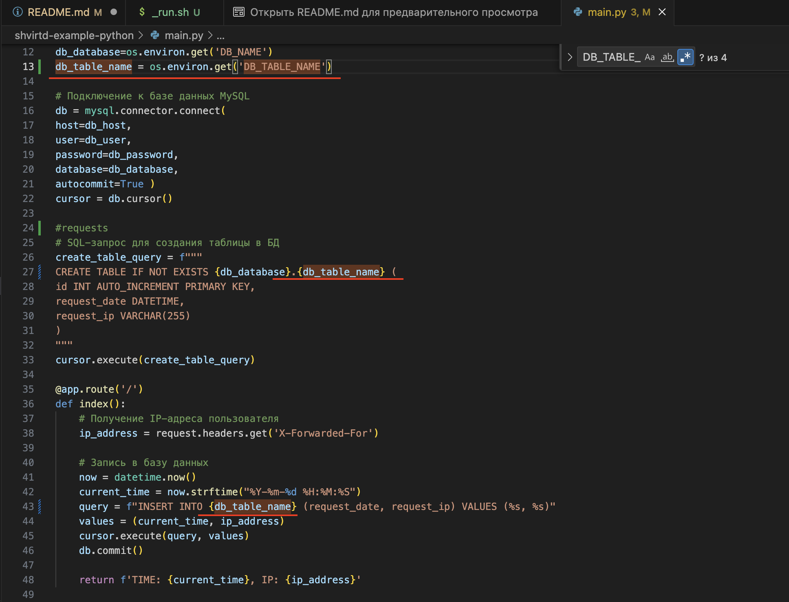
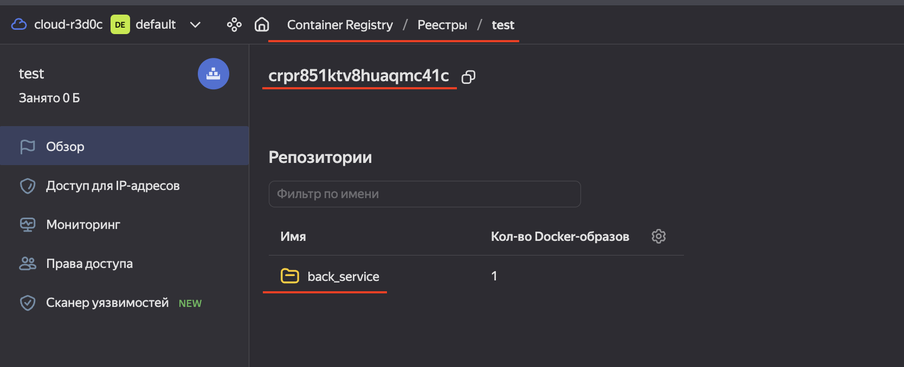
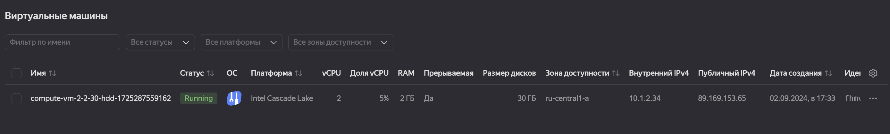
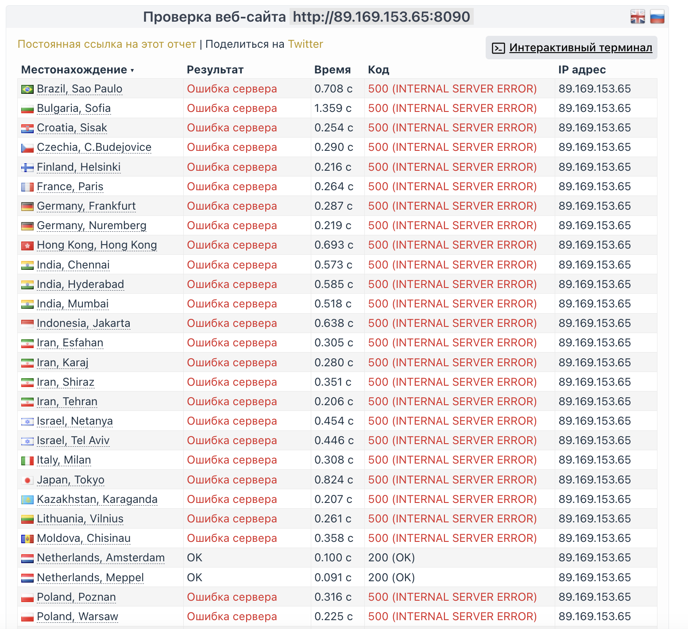
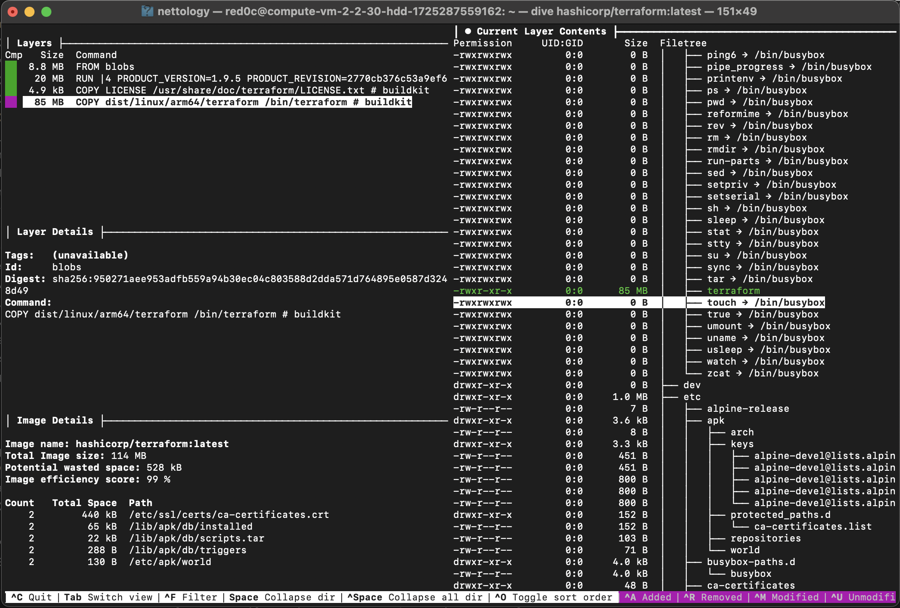
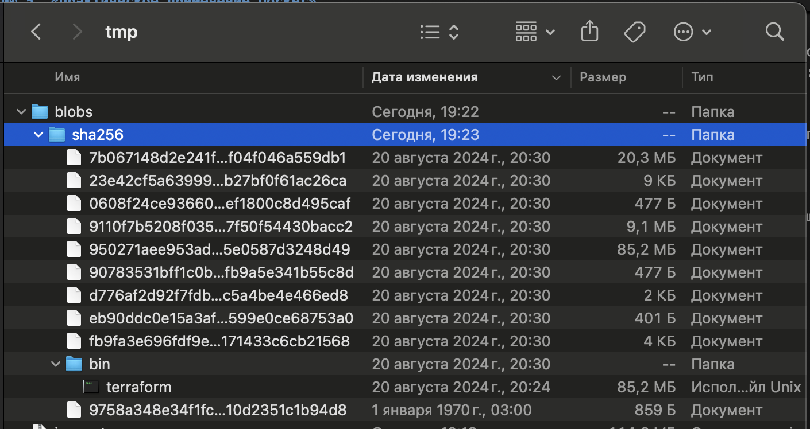
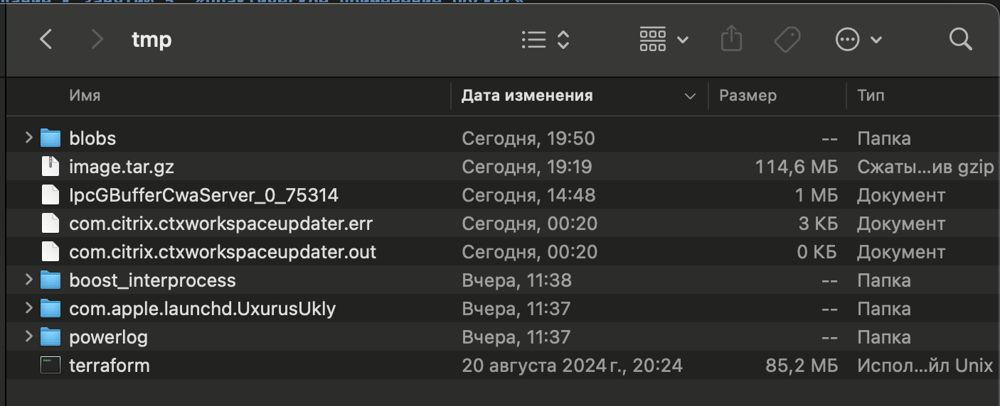

# Домашнее задание к занятию 5. «Практическое применение Docker»

### Инструкция к выполнению

1. Для выполнения заданий обязательно ознакомьтесь с [инструкцией](https://github.com/netology-code/devops-materials/blob/master/cloudwork.MD) по экономии облачных ресурсов. Это нужно, чтобы не расходовать средства, полученные в результате использования промокода.
3. **Своё решение к задачам оформите в вашем GitHub репозитории.**
4. В личном кабинете отправьте на проверку ссылку на .md-файл в вашем репозитории.
5. Сопроводите ответ необходимыми скриншотами.

---
## Примечание: Ознакомьтесь со схемой виртуального стенда [по ссылке](https://github.com/netology-code/shvirtd-example-python/blob/main/schema.pdf)

---

## Задача 0
1. Убедитесь что у вас НЕ(!) установлен ```docker-compose```, для этого получите следующую ошибку от команды ```docker-compose --version```
```
Command 'docker-compose' not found, but can be installed with:

sudo snap install docker          # version 24.0.5, or
sudo apt  install docker-compose  # version 1.25.0-1

See 'snap info docker' for additional versions.
```
В случае наличия установленного в системе ```docker-compose``` - удалите его.  
2. Убедитесь что у вас УСТАНОВЛЕН ```docker compose```(без тире) версии не менее v2.24.X, для это выполните команду ```docker compose version```  

```
alekseykashin@MacBook-Pro-Aleksej 05-virt-04-docker-in-practice % docker compose version
Docker Compose version v2.29.1-desktop.1
```
###  **Своё решение к задачам оформите в вашем GitHub репозитории!!!!!!!!!!!!!!!!!!!!!!!!!!!!!!!!**

---

## Задача 1
1. Сделайте в своем github пространстве fork репозитория ```https://github.com/netology-code/shvirtd-example-python/blob/main/README.md```.   
2. Создайте файл с именем ```Dockerfile.python``` для сборки данного проекта(для 3 задания изучите https://docs.docker.com/compose/compose-file/build/ ). Используйте базовый образ ```python:3.9-slim```. 
Обязательно используйте конструкцию ```COPY . .``` в Dockerfile. Не забудьте исключить ненужные в имадже файлы с помощью dockerignore. Протестируйте корректность сборки.  
```
alekseykashin@MacBook-Pro-Aleksej shvirtd-example-python % cat Dockerfile.python
FROM python:3.9-slim
WORKDIR /app
COPY . .
RUN pip install -r requirements.txt
CMD ["python", "main.py"]%  

alekseykashin@MacBook-Pro-Aleksej shvirtd-example-python % cat .dockerignore
**/*.pdf
**/.nev
**/Dockerfile*
LICENSE
README.md%  

alekseykashin@MacBook-Pro-Aleksej shvirtd-example-python % docker build -f Dockerfile.python -t back_service .
[+] Building 1.0s (9/9) FINISHED                                                                                                                                         docker:desktop-linux
 => [internal] load build definition from Dockerfile.python                                                                                                                              0.0s
 => => transferring dockerfile: 271B                                                                                                                                                     0.0s
 => [internal] load metadata for docker.io/library/python:3.9-slim                                                                                                                       0.9s
 => [internal] load .dockerignore                                                                                                                                                        0.0s
 => => transferring context: 136B                                                                                                                                                        0.0s
 => [1/4] FROM docker.io/library/python:3.9-slim@sha256:1e3437daae1d9cebce372794eacfac254dd108200e47c8b7f56a633ebd3e2a0a                                                                 0.0s
 => [internal] load build context                                                                                                                                                        0.0s
 => => transferring context: 2.69kB                                                                                                                                                      0.0s
 => CACHED [2/4] WORKDIR /app                                                                                                                                                            0.0s
 => CACHED [3/4] COPY . .                                                                                                                                                                0.0s
 => CACHED [4/4] RUN pip install -r requirements.txt                                                                                                                                     0.0s
 => exporting to image                                                                                                                                                                   0.0s
 => => exporting layers                                                                                                                                                                  0.0s
 => => writing image sha256:f7e4ce3832664904ce130509daa2dfd87929c94fa55e54085c031d4210376371                                                                                             0.0s
 => => naming to docker.io/library/back_service                                                                                                                                          0.0s

View build details: docker-desktop://dashboard/build/desktop-linux/desktop-linux/t0nj6plf88reouh4fwhlsvl6a

alekseykashin@MacBook-Pro-Aleksej shvirtd-example-python % docker image ls
REPOSITORY                         TAG            IMAGE ID       CREATED         SIZE
back_service                       latest         f7e4ce383266   3 minutes ago   247MB
```

3. (Необязательная часть, *) Изучите инструкцию в проекте и запустите web-приложение без использования docker в venv. (Mysql БД можно запустить в docker run).

### Решение
#### 1 Вариант

1. Создаем сеть 'back_net' 
```
alekseykashin@MacBook-Pro-Aleksej shvirtd-example-python % docker network create --driver=bridge back_net
665c88ee506a6a6e0d6572cd76680a6220b5336e3ba397a5c23d8ffacb7b3fa4
```
2. Выгружаем обрза mysql 8 из репозитория 
```
alekseykashin@MacBook-Pro-Aleksej shvirtd-example-python % docker pull mysql:8                           
8: Pulling from library/mysql
86a1ed2ecedf: Pull complete 
cf88b6547cb5: Pull complete 
906b5914950d: Pull complete 
c617af9dc74d: Pull complete 
4e52819b0ae2: Pull complete 
235f6a16f543: Pull complete 
0c6aaf631f1d: Pull complete 
17b83eb9ad50: Pull complete 
1b971475b2b0: Pull complete 
6fa369cdb9f9: Pull complete 
Digest: sha256:ad77a7c4e2031597e0c73a21993f780cdde6cef15d3dae734fe550c6142f8097
Status: Downloaded newer image for mysql:8
docker.io/library/mysql:8

What's next:
    View a summary of image vulnerabilities and recommendations → docker scout quickview mysql:8
```
3. Запускаем контейнер 'mysql' в сети 'back_net
```
alekseykashin@MacBook-Pro-Aleksej shvirtd-example-python % docker run -d --network='back_net' -v 'db_data:/var/lib/mysql' -e 'MYSQL_ROOT_PASSWORD=root' -e 'MYSQL_DATABASE=example' -e 'MYSQL_USER=user1' -e 'MYSQL_PASSWORD=pass1' --name mysql mysql:8 --mysql-native-password=ON 
9837cd0512eea0703ef8ce057d96a5ab3164952aeb839d76c0c1cfb42fde5534
```

4. Запускаем контейнер с сервисом 'back_app' в сети 'back_net'
```
docker run -d -p 5001:5000 --network='back_net' -e 'DB_HOST=mysql' -e 'DB_USER=user1' -e 'DB_PASSWORD=pass1' -e 'DB_NAME=example' --name back_app back_service 
```

5. Проверяем работу сервиса 

```
alekseykashin@MacBook-Pro-Aleksej shvirtd-example-python % curl http://localhost:5001
TIME: 2024-08-31 12:55:33, IP: None%  
```

#### 2 Вариант 

1. Запускаем контейнер 'mysql'  
``
docker run -d  -p 3306:3306 -v 'db_data:/var/lib/mysql' -e 'MYSQL_ROOT_PASSWORD=root' -e 'MYSQL_DATABASE=example' -e 'MYSQL_USER=user1' -e 'MYSQL_PASSWORD=pass1' --name mysql mysql:8 --mysql-native-password=ON
```
alekseykashin@MacBook-Pro-Aleksej shvirtd-example-python % docker run -d  -p 3306:3306 -v 'db_data:/var/lib/mysql' -e 'MYSQL_ROOT_PASSWORD=root' -e 'MYSQL_DATABASE=example' -e 'MYSQL_USER=user1' -e 'MYSQL_PASSWORD=pass1' --name mysql mysql:8 --mysql-native-password=ON
d023848d96a8c09adc601c558114bbeec54c627e67fc59a54544a39beb82d6b9
alekseykashin@MacBook-Pro-Aleksej shvirtd-example-python % docker ps
CONTAINER ID   IMAGE     COMMAND                  CREATED         STATUS         PORTS                               NAMES
d023848d96a8   mysql:8   "docker-entrypoint.s…"   4 seconds ago   Up 3 seconds   0.0.0.0:3306->3306/tcp, 33060/tcp   mysql
```

2. Создаем bash скрипт запуска python приложения, добавляем новую переменную для порта, запускать будем приложение на 5001 порту
```
alekseykashin@MacBook-Pro-Aleksej shvirtd-example-python % cat ./_run.sh
python3 -m venv venv  # on Windows, use "python -m venv venv" instead
. venv/bin/activate   # on Windows, use "venv\Scripts\activate" instead
pip install -r requirements.txt
$ cat $VIRTUAL_ENV/bin/postactivate
#!/bin/bash
# This hook is run after this virtualenv is activated.
export FLASK_RUN_PORT=5001
export DB_HOST=127.0.0.1
export DB_USER=user1
export DB_PASSWORD=pass1
export DB_NAME=example
python main.py%   
```
3. Запускаем приложение чере bash скирпт
```
alekseykashin@MacBook-Pro-Aleksej shvirtd-example-python % sh _run.sh
Requirement already satisfied: flask in ./venv/lib/python3.10/site-packages (from -r requirements.txt (line 1)) (3.0.3)
Requirement already satisfied: mysql-connector-python in ./venv/lib/python3.10/site-packages (from -r requirements.txt (line 2)) (9.0.0)
Requirement already satisfied: itsdangerous>=2.1.2 in ./venv/lib/python3.10/site-packages (from flask->-r requirements.txt (line 1)) (2.2.0)
Requirement already satisfied: Werkzeug>=3.0.0 in ./venv/lib/python3.10/site-packages (from flask->-r requirements.txt (line 1)) (3.0.4)
Requirement already satisfied: Jinja2>=3.1.2 in ./venv/lib/python3.10/site-packages (from flask->-r requirements.txt (line 1)) (3.1.4)
Requirement already satisfied: blinker>=1.6.2 in ./venv/lib/python3.10/site-packages (from flask->-r requirements.txt (line 1)) (1.8.2)
Requirement already satisfied: click>=8.1.3 in ./venv/lib/python3.10/site-packages (from flask->-r requirements.txt (line 1)) (8.1.7)
Requirement already satisfied: MarkupSafe>=2.0 in ./venv/lib/python3.10/site-packages (from Jinja2>=3.1.2->flask->-r requirements.txt (line 1)) (2.1.5)

[notice] A new release of pip is available: 23.0.1 -> 24.2
[notice] To update, run: pip install --upgrade pip
_run.sh: line 4: $: command not found
 * Tip: There are .env or .flaskenv files present. Do "pip install python-dotenv" to use them.
 * Serving Flask app 'main'
 * Debug mode: on
WARNING: This is a development server. Do not use it in a production deployment. Use a production WSGI server instead.
 * Running on all addresses (0.0.0.0)
 * Running on http://127.0.0.1:5001
 * Running on http://192.168.50.60:5001
Press CTRL+C to quit
 * Restarting with stat
 * Tip: There are .env or .flaskenv files present. Do "pip install python-dotenv" to use them.
 * Debugger is active!
 * Debugger PIN: 602-816-300
 127.0.0.1 - - [31/Aug/2024 16:06:12] "GET / HTTP/1.1" 200 -
```
4. Чтобы не прерывать заходим в новую консоль проверяем работу сервиса

```
Last login: Sat Aug 31 15:38:02 on ttys005
alekseykashin@MBP-Aleksej ~ % curl http://localhost:5001
TIME: 2024-08-31 16:06:12, IP: None%
```

4. (Необязательная часть, *) По образцу предоставленного python кода внесите в него исправление для управления названием используемой таблицы через ENV переменную.

### Решение

1. Добавляем в bash скрипт новую переменную
```
alekseykashin@MBP-Aleksej shvirtd-example-python % cat ./_run.sh
python3 -m venv venv  # on Windows, use "python -m venv venv" instead
. venv/bin/activate   # on Windows, use "venv\Scripts\activate" instead
pip install -r requirements.txt
$ cat $VIRTUAL_ENV/bin/postactivate
#!/bin/bash
# This hook is run after this virtualenv is activated.
export FLASK_RUN_PORT=5001
export DB_HOST=127.0.0.1
export DB_USER=user1
export DB_PASSWORD=pass1
export DB_NAME=example
export DB_TABLE_NAME=requests1
python main.py%
```

2. Добавляем в приложение новую глобавльную переменную и прокидываем по коду создания таблицы и обрщащение к ней (запись в таблицу)


3. Убеждаемся что приложение работает. Запускаем его
```
alekseykashin@MBP-Aleksej shvirtd-example-python % sh _run.sh
Requirement already satisfied: flask in ./venv/lib/python3.10/site-packages (from -r requirements.txt (line 1)) (3.0.3)
Requirement already satisfied: mysql-connector-python in ./venv/lib/python3.10/site-packages (from -r requirements.txt (line 2)) (9.0.0)
Requirement already satisfied: blinker>=1.6.2 in ./venv/lib/python3.10/site-packages (from flask->-r requirements.txt (line 1)) (1.8.2)
Requirement already satisfied: itsdangerous>=2.1.2 in ./venv/lib/python3.10/site-packages (from flask->-r requirements.txt (line 1)) (2.2.0)
Requirement already satisfied: Jinja2>=3.1.2 in ./venv/lib/python3.10/site-packages (from flask->-r requirements.txt (line 1)) (3.1.4)
Requirement already satisfied: Werkzeug>=3.0.0 in ./venv/lib/python3.10/site-packages (from flask->-r requirements.txt (line 1)) (3.0.4)
Requirement already satisfied: click>=8.1.3 in ./venv/lib/python3.10/site-packages (from flask->-r requirements.txt (line 1)) (8.1.7)
Requirement already satisfied: MarkupSafe>=2.0 in ./venv/lib/python3.10/site-packages (from Jinja2>=3.1.2->flask->-r requirements.txt (line 1)) (2.1.5)

[notice] A new release of pip is available: 23.0.1 -> 24.2
[notice] To update, run: pip install --upgrade pip
_run.sh: line 4: $: command not found
 * Tip: There are .env or .flaskenv files present. Do "pip install python-dotenv" to use them.
 * Serving Flask app 'main'
 * Debug mode: on
WARNING: This is a development server. Do not use it in a production deployment. Use a production WSGI server instead.
 * Running on all addresses (0.0.0.0)
 * Running on http://127.0.0.1:5001
 * Running on http://192.168.50.60:5001
Press CTRL+C to quit
 * Restarting with stat
 * Tip: There are .env or .flaskenv files present. Do "pip install python-dotenv" to use them.
 * Debugger is active!
 * Debugger PIN: 602-816-300

```

5. Проверяем работу сервиса 
```
alekseykashin@MBP-Aleksej ~ % curl http://localhost:5001
TIME: 2024-08-31 16:36:59, IP: None%   
```

6. Убеждаемся что в базу мы записали в новую таблицу ``requests1`` 
```
alekseykashin@MBP-Aleksej ~ % docker exec -it mysql bash
bash-5.1# mysql -uroot -p
Enter password: 
Welcome to the MySQL monitor.  Commands end with ; or \g.
Your MySQL connection id is 10
Server version: 8.4.2 MySQL Community Server - GPL

Copyright (c) 2000, 2024, Oracle and/or its affiliates.

Oracle is a registered trademark of Oracle Corporation and/or its
affiliates. Other names may be trademarks of their respective
owners.

Type 'help;' or '\h' for help. Type '\c' to clear the current input statement.

mysql> select * from example.requests1;
+----+---------------------+------------+
| id | request_date        | request_ip |
+----+---------------------+------------+
|  1 | 2024-08-31 16:36:58 | NULL       |
|  2 | 2024-08-31 16:36:59 | NULL       |
+----+---------------------+------------+
2 rows in set (0.00 sec)

mysql> 
```

---
### ВНИМАНИЕ!
!!! В процессе последующего выполнения ДЗ НЕ изменяйте содержимое файлов в fork-репозитории! Ваша задача ДОБАВИТЬ 5 файлов: ```Dockerfile.python```, ```compose.yaml```, ```.gitignore```, ```.dockerignore```,```bash-скрипт```. Если вам понадобилось внести иные изменения в проект - вы что-то делаете неверно!
---

## Задача 2 (*)
1. Создайте в yandex cloud container registry с именем "test" с помощью "yc tool" . [Инструкция](https://cloud.yandex.ru/ru/docs/container-registry/quickstart/?from=int-console-help)
2. Настройте аутентификацию вашего локального docker в yandex container registry.
3. Соберите и залейте в него образ с python приложением из задания №1.
4. Просканируйте образ на уязвимости.
5. В качестве ответа приложите отчет сканирования.

### Решение 

1. Cоздаем registry в ya cloud 
```
alekseykashin@MBP-Aleksej shvirtd-example-python % yc container registry create --name test             
done (1s)
id: crpr851ktv8huaqmc41c
folder_id: b1gvqnla1h39vg6o82d0
name: test
status: ACTIVE
created_at: "2024-09-01T07:40:47.930Z"

There is a new yc version '0.132.1' available. Current version: '0.131.1'.
See release notes at https://yandex.cloud/ru/docs/cli/release-notes
You can install it by running the following command in your shell:
        $ yc components update
```

2. Настраиваем аутентификацию вашего локального docker в yandex container registry
```
alekseykashin@MBP-Aleksej shvirtd-example-python % yc container registry configure-docker
docker configured to use yc --profile "default" for authenticating "cr.yandex" container registries
Credential helper is configured in '/Users/alekseykashin/.docker/config.json'
alekseykashin@MBP-Aleksej shvirtd-example-python % cat ~/.docker/config.json 
{
  "auths": {
    "ghcr.io": {},
    "https://index.docker.io/v1/": {}
  },
  "credHelpers": {
    "container-registry.cloud.yandex.net": "yc",
    "cr.cloud.yandex.net": "yc",
    "cr.yandex": "yc"
  },
  "credsStore": "desktop",
  "currentContext": "desktop-linux",
  "features": {
    "hooks": "true"
  },
  "plugins": {
    "debug": {
      "hooks": "exec"
    },
    "scout": {
      "hooks": "pull,buildx build"
    }
  }
}% 
```

3. Загружаем образ в ``test`` registry ya cloud

```
red0c@nettlogy-web:/opt/shvirtd-example-python$ sudo apt  install docker-compose
alekseykashin@MBP-Aleksej shvirtd-example-python %  docker tag back_service cr.yandex/crpr851ktv8huaqmc41c/back_service:latest
alekseykashin@MBP-Aleksej shvirtd-example-python % docker image ls                                                            
REPOSITORY                                    TAG       IMAGE ID       CREATED        SIZE
cr.yandex/crpr851ktv8huaqmc41c/back_service   latest    655ff2e905d7   19 hours ago   312MB
back_service                                  latest    655ff2e905d7   19 hours ago   312MB
mysql                                         8         11a5e588a69b   5 weeks ago    591MB
alekseykashin@MBP-Aleksej shvirtd-example-python %  docker push cr.yandex/crpr851ktv8huaqmc41c/back_service:latest
The push refers to repository [cr.yandex/crpr851ktv8huaqmc41c/back_service]
444af3362599: Pushed 
53eccbca1082: Pushed 
945fc808326c: Pushed 
97791036d356: Pushed 
02e8ea41f219: Pushed 
ed79b750b967: Pushed 
91bbafc72e16: Pushed 
07d2ee3f5712: Pushed 
latest: digest: sha256:88542251b69b89b89460ca9138093ca0fd1eb2c62d2257bdf1f0ee3db489ce52 size: 2000
alekseykashin@MBP-Aleksej shvirtd-example-python % 
```



4. Отчет о уязвимостях 

[Отчет](./vulnerabilities.csv)

## Задача 3
1. Изучите файл "proxy.yaml"
2. Создайте в репозитории с проектом файл ```compose.yaml```. С помощью директивы "include" подключите к нему файл "proxy.yaml".
3. Опишите в файле ```compose.yaml``` следующие сервисы: 

- ```web```. Образ приложения должен ИЛИ собираться при запуске compose из файла ```Dockerfile.python``` ИЛИ скачиваться из yandex cloud container registry(из задание №2 со *). Контейнер должен работать в bridge-сети с названием ```backend``` и иметь фиксированный ipv4-адрес ```172.20.0.5```. Сервис должен всегда перезапускаться в случае ошибок.
Передайте необходимые ENV-переменные для подключения к Mysql базе данных по сетевому имени сервиса ```web``` 

- ```db```. image=mysql:8. Контейнер должен работать в bridge-сети с названием ```backend``` и иметь фиксированный ipv4-адрес ```172.20.0.10```. Явно перезапуск сервиса в случае ошибок. Передайте необходимые ENV-переменные для создания: пароля root пользователя, создания базы данных, пользователя и пароля для web-приложения.Обязательно используйте уже существующий .env file для назначения секретных ENV-переменных!

2. Запустите проект локально с помощью docker compose , добейтесь его стабильной работы: команда ```curl -L http://127.0.0.1:8090``` должна возвращать в качестве ответа время и локальный IP-адрес. Если сервисы не стартуют воспользуйтесь командами: ```docker ps -a ``` и ```docker logs <container_name>``` . Если вместо IP-адреса вы получаете ```NULL``` --убедитесь, что вы шлете запрос на порт ```8090```, а не 5000.

5. Подключитесь к БД mysql с помощью команды ```docker exec <имя_контейнера> mysql -uroot -p<пароль root-пользователя>```(обратите внимание что между ключем -u и логином root нет пробела. это важно!!! тоже самое с паролем) . Введите последовательно команды (не забываем в конце символ ; ): ```show databases; use <имя вашей базы данных(по-умолчанию example)>; show tables; SELECT * from requests LIMIT 10;```.

6. Остановите проект. В качестве ответа приложите скриншот sql-запроса.

### Решение

1. Листинг ``compose`` файла 
```
alekseykashin@MBP-Aleksej shvirtd-example-python % cat compose.yaml
version: "3"
# The parser will ignore extension fields prefixed with x-
x-deploy: &deploy-dev
  deploy:
    resources:
      limits:
        cpus: "1"
        memory: 512M
      reservations:
        memory: 256M
x-env_file: &env_file
  env_file:
    - .env
x-restart: &restart
  restart: always #no, on-failure , always(default), unless-stopped 

include:
  - ./proxy.yaml

services:
  db:
    image: mysql:8
    volumes:
      - db_data:/var/lib/mysql
    <<: [*deploy-dev, *env_file, *restart]
    command: "--mysql-native-password=ON" 
    environment:
      - MYSQL_ROOT_PASSWORD=${MYSQL_ROOT_PASSWORD}
      - MYSQL_DATABASE=${MYSQL_DATABASE}
      - MYSQL_USER=${MYSQL_USER}
      - MYSQL_PASSWORD=${MYSQL_PASSWORD}
      - MYSQL_ROOT_HOST="%" # it's very important!!!
    healthcheck:
      test: mysqladmin ping -u $$MYSQL_USER --password=$$MYSQL_PASSWORD
      start_period: 5s
      interval: 5s
      timeout: 5s
      retries: 10
    networks:
      backend:
        ipv4_address: 172.20.0.10

  web:
    image: cr.yandex/crpr851ktv8huaqmc41c/back_service:latest
    #build:
    #  context: .
    #  dockerfile: ./Dockerfile.python
    depends_on: 
      - db
    <<: [*env_file, *restart]
    environment:
      - DB_NAME=${MYSQL_DATABASE}
      - DB_USER=${MYSQL_USER}
      - DB_PASSWORD=${MYSQL_PASSWORD}
      - DB_HOST=mysql_db
      - DB_TABLE_NAME=${WEB_DB_TABLE_NAME}
    networks:
      backend:
        ipv4_address: 172.20.0.5

volumes:
  db_data: {}

networks:
  local-dns:
    external: true%  
```

2. Стартуем ``compose`` файл

```
alekseykashin@MBP-Aleksej shvirtd-example-python % docker compose up -d
WARN[0000] /Users/alekseykashin/nettology/shvirtd-example-python/proxy.yaml: the attribute `version` is obsolete, it will be ignored, please remove it to avoid potential confusion 
WARN[0000] /Users/alekseykashin/nettology/shvirtd-example-python/compose.yaml: the attribute `version` is obsolete, it will be ignored, please remove it to avoid potential confusion 
[+] Running 5/5
 ✔ Network shvirtd-example-python_backend            Created                                                                                                                              0.0s 
 ✔ Container shvirtd-example-python-mysql_db-1       Started                                                                                                                              0.2s 
 ✔ Container shvirtd-example-python-flask-1          Started                                                                                                                              0.3s 
 ✔ Container shvirtd-example-python-reverse-proxy-1  Started                                                                                                                              0.4s 
 ✔ Container shvirtd-example-python-ingress-proxy-1  Started  
```

3. Убеждаемся что сервис возращает ответ 

```
alekseykashin@MBP-Aleksej shvirtd-example-python % curl -L http://127.0.0.1:8090
TIME: 2024-09-01 09:27:09, IP: 192.168.65.1%      
```

4. Подключаемся к серверу ``db`` и проверяем что что схема, таблица и записи присутсвуют

```
alekseykashin@MBP-Aleksej shvirtd-example-python % docker compose exec db mysql -uroot -pYtReWq4321
WARN[0000] /Users/alekseykashin/nettology/shvirtd-example-python/proxy.yaml: the attribute `version` is obsolete, it will be ignored, please remove it to avoid potential confusion 
WARN[0000] /Users/alekseykashin/nettology/shvirtd-example-python/compose.yaml: the attribute `version` is obsolete, it will be ignored, please remove it to avoid potential confusion 
mysql: [Warning] Using a password on the command line interface can be insecure.
Welcome to the MySQL monitor.  Commands end with ; or \g.
Your MySQL connection id is 13
Server version: 8.4.2 MySQL Community Server - GPL

Copyright (c) 2000, 2024, Oracle and/or its affiliates.

Oracle is a registered trademark of Oracle Corporation and/or its
affiliates. Other names may be trademarks of their respective
owners.

Type 'help;' or '\h' for help. Type '\c' to clear the current input statement.

mysql> show databases;
+--------------------+
| Database           |
+--------------------+
| information_schema |
| mysql              |
| performance_schema |
| sys                |
| virtd              |
+--------------------+
5 rows in set (0.00 sec)

mysql> use virtd;
Reading table information for completion of table and column names
You can turn off this feature to get a quicker startup with -A

Database changed
mysql> show tables;
+-----------------+
| Tables_in_virtd |
+-----------------+
| web_requests    |
+-----------------+
1 row in set (0.00 sec)

mysql> SELECT * from web_requests LIMIT 10;.
+----+---------------------+--------------+
| id | request_date        | request_ip   |
+----+---------------------+--------------+
|  1 | 2024-09-01 09:50:35 | 192.168.65.1 |
|  2 | 2024-09-01 09:50:37 | 192.168.65.1 |
|  3 | 2024-09-01 09:50:39 | 192.168.65.1 |
+----+---------------------+--------------+
3 rows in set (0.00 sec)

```

## Задача 4
1. Запустите в Yandex Cloud ВМ (вам хватит 2 Гб Ram).
2. Подключитесь к Вм по ssh и установите docker.
3. Напишите bash-скрипт, который скачает ваш fork-репозиторий в каталог /opt и запустит проект целиком.
4. Зайдите на сайт проверки http подключений, например(или аналогичный): ```https://check-host.net/check-http``` и запустите проверку вашего сервиса ```http://<внешний_IP-адрес_вашей_ВМ>:8090```. Таким образом трафик будет направлен в ingress-proxy. ПРИМЕЧАНИЕ: Приложение весьма вероятно упадет под нагрузкой, но успеет обработать часть запросов - этого достаточно.
5. (Необязательная часть) Дополнительно настройте remote ssh context к вашему серверу. Отобразите список контекстов и результат удаленного выполнения ```docker ps -a```
6. В качестве ответа повторите  sql-запрос и приложите скриншот с данного сервера, bash-скрипт и ссылку на fork-репозиторий.

### Решение 4 

1. Создаем виртуальную машину



2. Заливаем файлки ```bash``` в для установки и запуска а так-же подключаемся к ВМ 

> Листинг файликов 

```
red0c@compute-vm-2-2-30-hdd-1725287559162:~$ cat _docker_compose_install.sh
#!/bin/bash

DOCKER_CONFIG=${DOCKER_CONFIG:-$HOME/.docker} 
mkdir -p $DOCKER_CONFIG/cli-plugins
sudo curl -SL https://github.com/docker/compose/releases/download/v2.29.2/docker-compose-linux-x86_64 -o $DOCKER_CONFIG/cli-plugins/docker-compose
sudo chmod +x $DOCKER_CONFIG/cli-plugins/docker-compose
sudo chmod -x /var/run/docker.sock
sudo adduser $USER docker
newgrp docker
docker compose version

red0c@compute-vm-2-2-30-hdd-1725287559162:~$ cat _proj_load_and_run.sh
#!/bin/bash

sudo git clone https://github.com/x0r1x/shvirtd-example-python.git /opt/shvirtd-example-python
cd /opt/shvirtd-example-python
docker compose up -d
```

> Запуск

```
alekseykashin@MBP-Aleksej shvirtd-example-python % scp _docker_compose_install.sh red0c@89.169.153.65:~/   
_docker_compose_install.sh                                                                                                                                                          100%  396     8.2KB/s   00:00    
alekseykashin@MBP-Aleksej shvirtd-example-python % scp _proj_load_and_run.sh red0c@89.169.153.65:~/
_proj_load_and_run.sh                                                                                                                                                               100%  159     2.2KB/s   00:00 
alekseykashin@MBP-Aleksej shvirtd-example-python % ssh red0c@89.169.153.65                                                                 
Welcome to Ubuntu 22.04.2 LTS (GNU/Linux 5.15.0-73-generic x86_64)

 * Documentation:  https://help.ubuntu.com
 * Management:     https://landscape.canonical.com
 * Support:        https://ubuntu.com/advantage

  System information as of Mon Sep  2 06:01:20 PM MSK 2024

  System load:  0.0                Processes:                136
  Usage of /:   20.7% of 29.44GB   Users logged in:          0
  Memory usage: 14%                IPv4 address for docker0: 172.17.0.1
  Swap usage:   0%                 IPv4 address for eth0:    10.1.2.34


Expanded Security Maintenance for Applications is not enabled.

0 updates can be applied immediately.

Enable ESM Apps to receive additional future security updates.
See https://ubuntu.com/esm or run: sudo pro status


The list of available updates is more than a week old.
To check for new updates run: sudo apt update
New release '24.04.1 LTS' available.
Run 'do-release-upgrade' to upgrade to it.


Last login: Mon Sep  2 17:37:41 2024 from 94.25.169.122
```

3. Устанавливаем ```docker compose``` (если честно не очень понятно тут на докере надо было все поднять или докер компоуз)

```
red0c@compute-vm-2-2-30-hdd-1725287559162:~$ sh _docker_compose_install.sh
  % Total    % Received % Xferd  Average Speed   Time    Time     Time  Current
                                 Dload  Upload   Total   Spent    Left  Speed
  0     0    0     0    0     0      0      0 --:--:-- --:--:-- --:--:--     0
100 60.2M  100 60.2M    0     0  51.8M      0  0:00:01  0:00:01 --:--:--  140M
Adding user `red0c' to group `docker' ...
Adding user red0c to group docker
Done.

```

4. Запускаем проект

```
red0c@compute-vm-2-2-30-hdd-1725287559162:~$ sh _proj_load_and_run.sh
Cloning into '/opt/shvirtd-example-python'...
remote: Enumerating objects: 2173, done.
remote: Counting objects: 100% (1772/1772), done.
remote: Compressing objects: 100% (1576/1576), done.
remote: Total 2173 (delta 203), reused 1449 (delta 186), pack-reused 401 (from 1)
Receiving objects: 100% (2173/2173), 11.18 MiB | 16.89 MiB/s, done.
Resolving deltas: 100% (230/230), done.
WARN[0000] /opt/shvirtd-example-python/proxy.yaml: the attribute `version` is obsolete, it will be ignored, please remove it to avoid potential confusion 
WARN[0000] /opt/shvirtd-example-python/compose.yaml: the attribute `version` is obsolete, it will be ignored, please remove it to avoid potential confusion 
[+] Running 24/24
 ✔ db Pulled                                                                                                                                                                                                    60.6s 
   ✔ 6e839ac3722d Pull complete                                                                                                                                                                                 19.2s 
   ✔ 4e6ddf56df32 Pull complete                                                                                                                                                                                 22.8s 
   ✔ 25d13d87fd8d Pull complete                                                                                                                                                                                 27.6s 
   ✔ b32ea8d4b0b4 Pull complete                                                                                                                                                                                 36.7s 
   ✔ d7831e46745c Pull complete                                                                                                                                                                                 37.0s 
   ✔ f68dfd038d6f Pull complete                                                                                                                                                                                 37.1s 
   ✔ 400f83c08f60 Pull complete                                                                                                                                                                                 40.4s 
   ✔ f688763fd152 Pull complete                                                                                                                                                                                 40.6s 
   ✔ 6c44c25a80a1 Pull complete                                                                                                                                                                                 58.3s 
   ✔ 0a2d80756f3d Pull complete                                                                                                                                                                                 58.4s 
 ✔ reverse-proxy Pulled                                                                                                                                                                                         39.2s 
   ✔ e4fff0779e6d Pull complete                                                                                                                                                                                 22.4s 
   ✔ 5dbaa923ec5d Pull complete                                                                                                                                                                                 25.1s 
   ✔ 435c4974aa13 Pull complete                                                                                                                                                                                 30.7s 
   ✔ 417fe4774220 Pull complete                                                                                                                                                                                 36.7s 
   ✔ a3df79304e8d Pull complete                                                                                                                                                                                 37.0s 
 ✔ ingress-proxy Pulled                                                                                                                                                                                         39.5s 
   ✔ a330b6cecb98 Pull complete                                                                                                                                                                                  8.5s 
   ✔ 5ef80e6f29b5 Pull complete                                                                                                                                                                                 30.0s 
   ✔ f699b0db74e3 Pull complete                                                                                                                                                                                 36.8s 
   ✔ 0f701a34c55e Pull complete                                                                                                                                                                                 36.9s 
   ✔ 3229dce7b89c Pull complete                                                                                                                                                                                 37.1s 
   ✔ ddb78cb2d047 Pull complete                                                                                                                                                                                 37.3s 
[+] Building 40.7s (9/9) FINISHED                                                                                                                                                                      docker:default
 => [web internal] load build definition from Dockerfile.python                                                                                                                                                  0.2s
 => => transferring dockerfile: 271B                                                                                                                                                                             0.1s
 => [web internal] load .dockerignore                                                                                                                                                                            0.2s
 => => transferring context: 89B                                                                                                                                                                                 0.1s
 => [web internal] load metadata for docker.io/library/python:3.9-slim                                                                                                                                           1.9s
 => [web 1/4] FROM docker.io/library/python:3.9-slim@sha256:1e3437daae1d9cebce372794eacfac254dd108200e47c8b7f56a633ebd3e2a0a                                                                                    15.9s
 => => resolve docker.io/library/python:3.9-slim@sha256:1e3437daae1d9cebce372794eacfac254dd108200e47c8b7f56a633ebd3e2a0a                                                                                         0.0s
 => => sha256:1e3437daae1d9cebce372794eacfac254dd108200e47c8b7f56a633ebd3e2a0a 10.41kB / 10.41kB                                                                                                                 0.0s
 => => sha256:0d765163e487fbdd9c93b3b3b7233251d3222d48fa3f88475269a64f5e2b84be 1.94kB / 1.94kB                                                                                                                   0.0s
 => => sha256:d8892906392f0a3cd4706b6f30a88ee8870c6b6c370d35b498b0b93e7ed7bf5f 6.88kB / 6.88kB                                                                                                                   0.0s
 => => sha256:5be20a4ff2774cd684d410f8ea49b03991524f012d2f5a93e1ef573451b2bd6e 3.51MB / 3.51MB                                                                                                                   0.5s
 => => sha256:48174a2f2dd9bbae1a67ceb64b7ab049fe8b392f1a6aae6937152c034ffcb138 11.89MB / 11.89MB                                                                                                                 2.3s
 => => sha256:0cb9f64d8db64a7b5c5f6aa8ee563fed15ae2df77f1659eb143d0d6f5ee43573 232B / 232B                                                                                                                       1.3s
 => => extracting sha256:5be20a4ff2774cd684d410f8ea49b03991524f012d2f5a93e1ef573451b2bd6e                                                                                                                        0.4s
 => => sha256:c9140ff79093c868190cd8e242ae1738f9fe734fd53081717fd559b8268cf3d3 2.77MB / 2.77MB                                                                                                                   3.0s
 => => extracting sha256:48174a2f2dd9bbae1a67ceb64b7ab049fe8b392f1a6aae6937152c034ffcb138                                                                                                                        0.6s
 => => extracting sha256:0cb9f64d8db64a7b5c5f6aa8ee563fed15ae2df77f1659eb143d0d6f5ee43573                                                                                                                        0.0s
 => => extracting sha256:c9140ff79093c868190cd8e242ae1738f9fe734fd53081717fd559b8268cf3d3                                                                                                                        1.1s
 => [web internal] load build context                                                                                                                                                                           18.2s
 => => transferring context: 78.13MB                                                                                                                                                                            18.1s
 => [web 2/4] WORKDIR /app                                                                                                                                                                                       2.0s
 => [web 3/4] COPY . .                                                                                                                                                                                           5.2s
 => [web 4/4] RUN pip install -r requirements.txt                                                                                                                                                               13.3s
 => [web] exporting to image                                                                                                                                                                                     1.6s 
 => => exporting layers                                                                                                                                                                                          1.4s 
 => => writing image sha256:e7cdbfa04eae25b6b6136c08e6fc9e2623b053ede2d1ba15449e249cb07dcce9                                                                                                                     0.0s 
 => => naming to docker.io/library/shvirtd-example-python-web                                                                                                                                                    0.0s 
WARN[0061] current commit information was not captured by the build  error="failed to read current commit information with git rev-parse --is-inside-work-tree"                                                       
[+] Running 6/6                                                                                                                                                                                                       
 ✔ Network shvirtd-example-python_backend            Created                                                                                                                                                     0.3s 
 ✔ Volume "shvirtd-example-python_db_data"           Created                                                                                                                                                     0.1s 
 ✔ Container shvirtd-example-python-db-1             Started                                                                                                                                                     1.6s 
 ✔ Container shvirtd-example-python-web-1            Started                                                                                                                                                     2.0s 
 ✔ Container shvirtd-example-python-reverse-proxy-1  Started                                                                                                                                                     2.5s 
 ✔ Container shvirtd-example-python-ingress-proxy-1  Started     
 red0c@compute-vm-2-2-30-hdd-1725287559162:~$ cd /opt/shvirtd-example-python
 red0c@compute-vm-2-2-30-hdd-1725287559162:/opt/shvirtd-example-python$ docker compose ps
WARN[0000] /opt/shvirtd-example-python/proxy.yaml: the attribute `version` is obsolete, it will be ignored, please remove it to avoid potential confusion 
WARN[0000] /opt/shvirtd-example-python/compose.yaml: the attribute `version` is obsolete, it will be ignored, please remove it to avoid potential confusion 
NAME                                     IMAGE                        COMMAND                  SERVICE         CREATED         STATUS                   PORTS
shvirtd-example-python-db-1              mysql:8                      "docker-entrypoint.s…"   db              5 minutes ago   Up 5 minutes (healthy)   3306/tcp, 33060/tcp
shvirtd-example-python-ingress-proxy-1   nginx:1.21.1                 "/docker-entrypoint.…"   ingress-proxy   5 minutes ago   Up 4 minutes             80/tcp, 0.0.0.0:8090->8090/tcp
shvirtd-example-python-reverse-proxy-1   haproxy:2.4                  "docker-entrypoint.s…"   reverse-proxy   5 minutes ago   Up 4 minutes             127.0.0.1:8080->8080/tcp
shvirtd-example-python-web-1             shvirtd-example-python-web   "python main.py"         web             5 minutes ago   Up 3 minutes                        
```

5. Проверяем что запросы отправляются на сервер ```https://check-host.net```, убеждаемся что ответы записаны в базу данных



```
red0c@compute-vm-2-2-30-hdd-1725287559162:/opt/shvirtd-example-python$ docker compose exec db mysql -uroot -pYtReWq4321
WARN[0000] /opt/shvirtd-example-python/proxy.yaml: the attribute `version` is obsolete, it will be ignored, please remove it to avoid potential confusion 
WARN[0000] /opt/shvirtd-example-python/compose.yaml: the attribute `version` is obsolete, it will be ignored, please remove it to avoid potential confusion 
mysql: [Warning] Using a password on the command line interface can be insecure.
Welcome to the MySQL monitor.  Commands end with ; or \g.
Your MySQL connection id is 116
Server version: 8.4.2 MySQL Community Server - GPL

Copyright (c) 2000, 2024, Oracle and/or its affiliates.

Oracle is a registered trademark of Oracle Corporation and/or its
affiliates. Other names may be trademarks of their respective
owners.

Type 'help;' or '\h' for help. Type '\c' to clear the current input statement.

mysql> show databases;
+--------------------+
| Database           |
+--------------------+
| information_schema |
| mysql              |
| performance_schema |
| sys                |
| virtd              |
+--------------------+
5 rows in set (0.17 sec)

mysql> use virtd;
Reading table information for completion of table and column names
You can turn off this feature to get a quicker startup with -A

Database changed
mysql> show tables;
+-----------------+
| Tables_in_virtd |
+-----------------+
| web_requests    |
+-----------------+
1 row in set (0.01 sec)

mysql> SELECT * from web_requests LIMIT 10;
+----+---------------------+-----------------+
| id | request_date        | request_ip      |
+----+---------------------+-----------------+
|  1 | 2024-09-02 15:09:11 | 172.20.0.1      |
|  2 | 2024-09-02 15:09:16 | 94.25.169.122   |
|  3 | 2024-09-02 15:10:29 | 195.211.27.85   |
|  4 | 2024-09-02 15:10:29 | 185.209.161.169 |
|  5 | 2024-09-02 15:10:29 | 167.235.135.184 |
+----+---------------------+-----------------+
5 rows in set (0.01 sec)

mysql> 
```

## Задача 5 (*)
1. Напишите и задеплойте на вашу облачную ВМ bash скрипт, который произведет резервное копирование БД mysql в директорию "/opt/backup" с помощью запуска в сети "backend" контейнера из образа ```schnitzler/mysqldump``` при помощи ```docker run ...``` команды. Подсказка: "документация образа."
2. Протестируйте ручной запуск
3. Настройте выполнение скрипта раз в 1 минуту через cron, crontab или systemctl timer. Придумайте способ не светить логин/пароль в git!!
4. Предоставьте скрипт, cron-task и скриншот с несколькими резервными копиями в "/opt/backup"

## Задача 6
Скачайте docker образ ```hashicorp/terraform:latest``` и скопируйте бинарный файл ```/bin/terraform``` на свою локальную машину, используя dive и docker save.
Предоставьте скриншоты  действий .

### Решение 



```
alekseykashin@MBP-Aleksej nettology % docker image  save -o  /tmp/image.tar.gz hashicorp/terraform:latest
alekseykashin@MBP-Aleksej nettology % cd /tmp/image.tar.gz
cd: not a directory: /tmp/image.tar.gz
alekseykashin@MBP-Aleksej nettology % cd /tmp             
alekseykashin@MBP-Aleksej /tmp % ls
IpcGBufferCwaServer_0_75314		com.apple.launchd.UxurusUkly		com.citrix.ctxworkspaceupdater.out	ovpnconnect-local-ipc.sock
boost_interprocess			com.citrix.ctxworkspaceupdater.err	image.tar.gz				powerlog
alekseykashin@MBP-Aleksej /tmp % tar xf /tmp/image.tar.gz
alekseykashin@MBP-Aleksej /tmp % cd /tmp        
alekseykashin@MBP-Aleksej /tmp % ls
IpcGBufferCwaServer_0_75314		com.citrix.ctxworkspaceupdater.err	manifest.json				repositories
blobs					com.citrix.ctxworkspaceupdater.out	oci-layout
boost_interprocess			image.tar.gz				ovpnconnect-local-ipc.sock
com.apple.launchd.UxurusUkly		index.json				powerlog
alekseykashin@MBP-Aleksej /tmp % cd /tmp/blobs/sha256 
alekseykashin@MBP-Aleksej sha256 % ls
0608f24ce936600741bd7a4bb8c5616c49e7053def2b7f46bef1800c8d495caf	950271aee953adfb559a94b30ec04c803588d2dda571d764895e0587d3248d49
23e42cf5a63999d6c5003546afc466b72ce97298d8f6ba7a3b27bf0f61ac26ca	9758a348e34f1fc612654661cb24d6d80f8ee9a85a4d4effb910d2351c1b94d8
7b067148d2e241f7b6f27698b7717ca8712510f1872ace5ce9f04f046a559db1	d776af2d92f7fdb7f1642f3f1a83270c010d587dabcffe2504c5a4be4e466ed8
90783531bff1c0b841d8c0e5a3369c9e271057bc69c2cc178fb9a5e341b55c8d	eb90ddc0e15a3af7389245f9393480fbf5bf7a10d22886e2bf599e0ce68753a0
9110f7b5208f035f4d4f99b5169338169e1df9bb2519d1b047f50f54430bacc2	fb9fa3e696fdf9e515ba529e767bb39693890bf827d070703171433c6cb21568
alekseykashin@MBP-Aleksej sha256 % tar xf 950271aee953adfb559a94b30ec04c803588d2dda571d764895e0587d3248d49 
alekseykashin@MBP-Aleksej sha256 % ls
0608f24ce936600741bd7a4bb8c5616c49e7053def2b7f46bef1800c8d495caf	9758a348e34f1fc612654661cb24d6d80f8ee9a85a4d4effb910d2351c1b94d8
23e42cf5a63999d6c5003546afc466b72ce97298d8f6ba7a3b27bf0f61ac26ca	bin
7b067148d2e241f7b6f27698b7717ca8712510f1872ace5ce9f04f046a559db1	d776af2d92f7fdb7f1642f3f1a83270c010d587dabcffe2504c5a4be4e466ed8
90783531bff1c0b841d8c0e5a3369c9e271057bc69c2cc178fb9a5e341b55c8d	eb90ddc0e15a3af7389245f9393480fbf5bf7a10d22886e2bf599e0ce68753a0
9110f7b5208f035f4d4f99b5169338169e1df9bb2519d1b047f50f54430bacc2	fb9fa3e696fdf9e515ba529e767bb39693890bf827d070703171433c6cb21568
950271aee953adfb559a94b30ec04c803588d2dda571d764895e0587d3248d49
alekseykashin@MBP-Aleksej sha256 % cd bin
alekseykashin@MBP-Aleksej bin % ls
terraform
```


## Задача 6.1
Добейтесь аналогичного результата, используя docker cp.  
Предоставьте скриншоты  действий .

### Решение
1. Запускаем контейнер и скачиваем из него файлик ```terraform```
```
alekseykashin@MBP-Aleksej task_6_1 % docker run -i -t hashicorp/terraform:latest -version          
Terraform v1.9.5
on linux_arm64
alekseykashin@MBP-Aleksej task_6_1 % docker cp f360cddeabb1126809a8d7b8122d4e8694af977b2a4b48a7ed84fee93e2ef347:/bin/terraform /tmp/terraform
Successfully copied 85.2MB to /tmp/terraform
alekseykashin@MBP-Aleksej task_6_1 % cd /tmp  
alekseykashin@MBP-Aleksej /tmp % ls
IpcGBufferCwaServer_0_75314		com.apple.launchd.UxurusUkly		image.tar.gz				terraform
blobs					com.citrix.ctxworkspaceupdater.err	ovpnconnect-local-ipc.sock
boost_interprocess			com.citrix.ctxworkspaceupdater.out	powerlog
alekseykashin@MBP-Aleksej /tmp % 
```


## Задача 6.2 (**)
Предложите способ извлечь файл из контейнера, используя только команду docker build и любой Dockerfile.  
Предоставьте скриншоты  действий .

## Задача 7 (***)
Запустите ваше python-приложение с помощью runC, не используя docker или containerd.  
Предоставьте скриншоты  действий .
