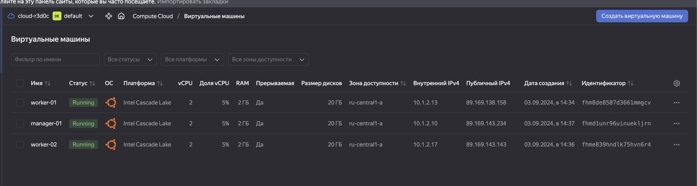

# Домашнее задание к занятию 6. «Оркестрация кластером Docker контейнеров на примере Docker Swarm»

#### Это задание для самостоятельной отработки навыков и не предполагает обратной связи от преподавателя. Его выполнение не влияет на завершение модуля. Но мы рекомендуем его выполнить, чтобы закрепить полученные знания. Все вопросы, возникающие в процессе выполнения заданий, пишите в учебный чат или в раздел "Вопросы по заданиям" в личном кабинете.

---

## Важно

**Перед началом работы над заданием изучите [Инструкцию по экономии облачных ресурсов](https://github.com/netology-code/devops-materials/blob/master/cloudwork.MD).**
Перед отправкой работы на проверку удаляйте неиспользуемые ресурсы.
Это нужно, чтобы не расходовать средства, полученные в результате использования промокода.
Подробные рекомендации [здесь](https://github.com/netology-code/virt-homeworks/blob/virt-11/r/README.md).

[Ссылки для установки открытого ПО](https://github.com/netology-code/devops-materials/blob/master/README.md).

---

## Задача 1

Создайте ваш первый Docker Swarm-кластер в Яндекс Облаке.
Документация swarm: https://docs.docker.com/engine/reference/commandline/swarm_init/
1. Создайте 3 облачные виртуальные машины в одной сети.
2. Установите docker на каждую ВМ.
3. Создайте swarm-кластер из 1 мастера и 2-х рабочих нод.

4. Проверьте список нод командой:
```
docker node ls
```
### Решение 

1. Создаем 3 VM в ```ya cloud```



2. Устанавливаем докер на каждую VM

> manager-01
```
Last login: Mon Sep  2 19:08:16 on ttys006
alekseykashin@MBP-Aleksej ~ % ssh red0c@89.169.143.234
The authenticity of host '89.169.143.234 (89.169.143.234)' can't be established.
ED25519 key fingerprint is SHA256:NzpuKjRj79ttlE9I3rwrLM3ky7Y6ND7Gx42+IXcxRMU.
This key is not known by any other names.
Are you sure you want to continue connecting (yes/no/[fingerprint])? yes
Warning: Permanently added '89.169.143.234' (ED25519) to the list of known hosts.
Welcome to Ubuntu 20.04.6 LTS (GNU/Linux 5.4.0-193-generic x86_64)

 * Documentation:  https://help.ubuntu.com
 * Management:     https://landscape.canonical.com
 * Support:        https://ubuntu.com/pro

The programs included with the Ubuntu system are free software;
the exact distribution terms for each program are described in the
individual files in /usr/share/doc/*/copyright.

Ubuntu comes with ABSOLUTELY NO WARRANTY, to the extent permitted by
applicable law.

red0c@manager-01:~$ sudo apt-get update
Hit:1 http://mirror.yandex.ru/ubuntu focal InRelease
Get:2 http://mirror.yandex.ru/ubuntu focal-updates InRelease [128 kB]
Hit:3 http://mirror.yandex.ru/ubuntu focal-backports InRelease
Get:4 http://security.ubuntu.com/ubuntu focal-security InRelease [128 kB]
Get:5 http://mirror.yandex.ru/ubuntu focal-updates/main amd64 Packages [3,536 kB]
Get:6 http://mirror.yandex.ru/ubuntu focal-updates/main i386 Packages [1,025 kB]
Get:7 http://mirror.yandex.ru/ubuntu focal-updates/main Translation-en [547 kB]
Get:8 http://mirror.yandex.ru/ubuntu focal-updates/universe i386 Packages [807 kB]
Get:9 http://mirror.yandex.ru/ubuntu focal-updates/universe amd64 Packages [1,229 kB]
Get:10 http://mirror.yandex.ru/ubuntu focal-updates/universe Translation-en [294 kB]
Get:11 http://mirror.yandex.ru/ubuntu focal-updates/universe amd64 c-n-f Metadata [28.0 kB]
Get:12 http://security.ubuntu.com/ubuntu focal-security/main amd64 Packages [3,164 kB]
Get:13 http://security.ubuntu.com/ubuntu focal-security/main i386 Packages [804 kB]
Get:14 http://security.ubuntu.com/ubuntu focal-security/main Translation-en [468 kB]
Get:15 http://security.ubuntu.com/ubuntu focal-security/universe i386 Packages [680 kB]
Get:16 http://security.ubuntu.com/ubuntu focal-security/universe amd64 Packages [1,009 kB]
Get:17 http://security.ubuntu.com/ubuntu focal-security/universe Translation-en [213 kB]
Get:18 http://security.ubuntu.com/ubuntu focal-security/universe amd64 c-n-f Metadata [21.2 kB]
Fetched 14.1 MB in 3s (4,308 kB/s)                                       
Reading package lists... Done
red0c@manager-01:~$ sudo apt install docker.io
Reading package lists... Done
Building dependency tree       
Reading state information... Done
The following additional packages will be installed:
  bridge-utils containerd dns-root-data dnsmasq-base git git-man
  libcurl3-gnutls liberror-perl libgdbm-compat4 libidn11 libperl5.30 patch
  perl perl-modules-5.30 pigz runc ubuntu-fan
Suggested packages:
  ifupdown aufs-tools btrfs-progs cgroupfs-mount | cgroup-lite debootstrap
  docker-doc rinse zfs-fuse | zfsutils git-daemon-run | git-daemon-sysvinit
  git-doc git-el git-email git-gui gitk gitweb git-cvs git-mediawiki git-svn
  diffutils-doc perl-doc libterm-readline-gnu-perl
  | libterm-readline-perl-perl make libb-debug-perl liblocale-codes-perl
The following NEW packages will be installed:
  bridge-utils containerd dns-root-data dnsmasq-base docker.io git git-man
  libcurl3-gnutls liberror-perl libgdbm-compat4 libidn11 libperl5.30 patch
  perl perl-modules-5.30 pigz runc ubuntu-fan
0 upgraded, 18 newly installed, 0 to remove and 1 not upgraded.
Need to get 81.8 MB of archives.
After this operation, 370 MB of additional disk space will be used.
Do you want to continue? [Y/n] Y
Get:1 http://mirror.yandex.ru/ubuntu focal-updates/main amd64 perl-modules-5.30 all 5.30.0-9ubuntu0.5 [2,739 kB]
Get:2 http://mirror.yandex.ru/ubuntu focal/main amd64 libgdbm-compat4 amd64 1.18.1-5 [6,244 B]
Get:3 http://mirror.yandex.ru/ubuntu focal-updates/main amd64 libperl5.30 amd64 5.30.0-9ubuntu0.5 [3,941 kB]
Get:4 http://mirror.yandex.ru/ubuntu focal-updates/main amd64 perl amd64 5.30.0-9ubuntu0.5 [224 kB]
Get:5 http://mirror.yandex.ru/ubuntu focal/universe amd64 pigz amd64 2.4-1 [57.4 kB]
Get:6 http://mirror.yandex.ru/ubuntu focal/main amd64 bridge-utils amd64 1.6-2ubuntu1 [30.5 kB]
Get:7 http://mirror.yandex.ru/ubuntu focal-updates/main amd64 runc amd64 1.1.12-0ubuntu2~20.04.1 [8,066 kB]
Get:8 http://mirror.yandex.ru/ubuntu focal-updates/main amd64 containerd amd64 1.7.12-0ubuntu2~20.04.1 [34.1 MB]
Get:9 http://mirror.yandex.ru/ubuntu focal-updates/main amd64 dns-root-data all 2023112702~ubuntu0.20.04.1 [5,308 B]
Get:10 http://mirror.yandex.ru/ubuntu focal/main amd64 libidn11 amd64 1.33-2.2ubuntu2 [46.2 kB]
Get:11 http://mirror.yandex.ru/ubuntu focal-updates/main amd64 dnsmasq-base amd64 2.90-0ubuntu0.20.04.1 [350 kB]
Get:12 http://mirror.yandex.ru/ubuntu focal-updates/universe amd64 docker.io amd64 24.0.7-0ubuntu2~20.04.1 [26.3 MB]
Get:13 http://mirror.yandex.ru/ubuntu focal-updates/main amd64 libcurl3-gnutls amd64 7.68.0-1ubuntu2.23 [232 kB]
Get:14 http://mirror.yandex.ru/ubuntu focal/main amd64 liberror-perl all 0.17029-1 [26.5 kB]
Get:15 http://mirror.yandex.ru/ubuntu focal-updates/main amd64 git-man all 1:2.25.1-1ubuntu3.13 [887 kB]
Get:16 http://mirror.yandex.ru/ubuntu focal-updates/main amd64 git amd64 1:2.25.1-1ubuntu3.13 [4,612 kB]
Get:17 http://mirror.yandex.ru/ubuntu focal/main amd64 patch amd64 2.7.6-6 [105 kB]
Get:18 http://mirror.yandex.ru/ubuntu focal-updates/main amd64 ubuntu-fan all 0.12.13ubuntu0.1 [34.4 kB]
Fetched 81.8 MB in 5s (15.5 MB/s)       
Preconfiguring packages ...
Selecting previously unselected package perl-modules-5.30.
(Reading database ... 102670 files and directories currently installed.)
Preparing to unpack .../00-perl-modules-5.30_5.30.0-9ubuntu0.5_all.deb ...
Unpacking perl-modules-5.30 (5.30.0-9ubuntu0.5) ...
Selecting previously unselected package libgdbm-compat4:amd64.
Preparing to unpack .../01-libgdbm-compat4_1.18.1-5_amd64.deb ...
Unpacking libgdbm-compat4:amd64 (1.18.1-5) ...
Selecting previously unselected package libperl5.30:amd64.
Preparing to unpack .../02-libperl5.30_5.30.0-9ubuntu0.5_amd64.deb ...
Unpacking libperl5.30:amd64 (5.30.0-9ubuntu0.5) ...
Selecting previously unselected package perl.
Preparing to unpack .../03-perl_5.30.0-9ubuntu0.5_amd64.deb ...
Unpacking perl (5.30.0-9ubuntu0.5) ...
Selecting previously unselected package pigz.
Preparing to unpack .../04-pigz_2.4-1_amd64.deb ...
Unpacking pigz (2.4-1) ...
Selecting previously unselected package bridge-utils.
Preparing to unpack .../05-bridge-utils_1.6-2ubuntu1_amd64.deb ...
Unpacking bridge-utils (1.6-2ubuntu1) ...
Selecting previously unselected package runc.
Preparing to unpack .../06-runc_1.1.12-0ubuntu2~20.04.1_amd64.deb ...
Unpacking runc (1.1.12-0ubuntu2~20.04.1) ...
Selecting previously unselected package containerd.
Preparing to unpack .../07-containerd_1.7.12-0ubuntu2~20.04.1_amd64.deb ...
Unpacking containerd (1.7.12-0ubuntu2~20.04.1) ...
Selecting previously unselected package dns-root-data.
Preparing to unpack .../08-dns-root-data_2023112702~ubuntu0.20.04.1_all.deb ...
Unpacking dns-root-data (2023112702~ubuntu0.20.04.1) ...
Selecting previously unselected package libidn11:amd64.
Preparing to unpack .../09-libidn11_1.33-2.2ubuntu2_amd64.deb ...
Unpacking libidn11:amd64 (1.33-2.2ubuntu2) ...
Selecting previously unselected package dnsmasq-base.
Preparing to unpack .../10-dnsmasq-base_2.90-0ubuntu0.20.04.1_amd64.deb ...
Unpacking dnsmasq-base (2.90-0ubuntu0.20.04.1) ...
Selecting previously unselected package docker.io.
Preparing to unpack .../11-docker.io_24.0.7-0ubuntu2~20.04.1_amd64.deb ...
Unpacking docker.io (24.0.7-0ubuntu2~20.04.1) ...
Selecting previously unselected package libcurl3-gnutls:amd64.
Preparing to unpack .../12-libcurl3-gnutls_7.68.0-1ubuntu2.23_amd64.deb ...
Unpacking libcurl3-gnutls:amd64 (7.68.0-1ubuntu2.23) ...
Selecting previously unselected package liberror-perl.
Preparing to unpack .../13-liberror-perl_0.17029-1_all.deb ...
Unpacking liberror-perl (0.17029-1) ...
Selecting previously unselected package git-man.
Preparing to unpack .../14-git-man_1%3a2.25.1-1ubuntu3.13_all.deb ...
Unpacking git-man (1:2.25.1-1ubuntu3.13) ...
Selecting previously unselected package git.
Preparing to unpack .../15-git_1%3a2.25.1-1ubuntu3.13_amd64.deb ...
Unpacking git (1:2.25.1-1ubuntu3.13) ...
Selecting previously unselected package patch.
Preparing to unpack .../16-patch_2.7.6-6_amd64.deb ...
Unpacking patch (2.7.6-6) ...
Selecting previously unselected package ubuntu-fan.
Preparing to unpack .../17-ubuntu-fan_0.12.13ubuntu0.1_all.deb ...
Unpacking ubuntu-fan (0.12.13ubuntu0.1) ...
Setting up perl-modules-5.30 (5.30.0-9ubuntu0.5) ...
Setting up libcurl3-gnutls:amd64 (7.68.0-1ubuntu2.23) ...
Setting up runc (1.1.12-0ubuntu2~20.04.1) ...
Setting up dns-root-data (2023112702~ubuntu0.20.04.1) ...
Setting up libidn11:amd64 (1.33-2.2ubuntu2) ...
Setting up patch (2.7.6-6) ...
Setting up libgdbm-compat4:amd64 (1.18.1-5) ...
Setting up bridge-utils (1.6-2ubuntu1) ...
Setting up pigz (2.4-1) ...
Setting up libperl5.30:amd64 (5.30.0-9ubuntu0.5) ...
Setting up git-man (1:2.25.1-1ubuntu3.13) ...
Setting up containerd (1.7.12-0ubuntu2~20.04.1) ...
Created symlink /etc/systemd/system/multi-user.target.wants/containerd.service → /lib/systemd/system/containerd.service.
Setting up docker.io (24.0.7-0ubuntu2~20.04.1) ...
Adding group `docker' (GID 116) ...
Done.
Created symlink /etc/systemd/system/multi-user.target.wants/docker.service → /lib/systemd/system/docker.service.
Created symlink /etc/systemd/system/sockets.target.wants/docker.socket → /lib/systemd/system/docker.socket.
Setting up dnsmasq-base (2.90-0ubuntu0.20.04.1) ...
Setting up perl (5.30.0-9ubuntu0.5) ...
Setting up ubuntu-fan (0.12.13ubuntu0.1) ...
Created symlink /etc/systemd/system/multi-user.target.wants/ubuntu-fan.service → /lib/systemd/system/ubuntu-fan.service.
Setting up liberror-perl (0.17029-1) ...
Setting up git (1:2.25.1-1ubuntu3.13) ...
Processing triggers for systemd (245.4-4ubuntu3.23) ...
Processing triggers for man-db (2.9.1-1) ...
Processing triggers for dbus (1.12.16-2ubuntu2.3) ...
Processing triggers for libc-bin (2.31-0ubuntu9.16) ...
red0c@manager-01:~$ docker --version
Docker version 24.0.7, build 24.0.7-0ubuntu2~20.04.1
red0c@manager-01:~$ 
```

> worker-01
```
Last login: Tue Sep  3 14:13:16 on ttys000
alekseykashin@MBP-Aleksej ~ % ssh red0c@89.169.138.158
The authenticity of host '89.169.138.158 (89.169.138.158)' can't be established.
ED25519 key fingerprint is SHA256:DeBFsQZnmpzi5iSi7RG3q4uXL8FdliMKFhZIx//xkM8.
This key is not known by any other names.
Are you sure you want to continue connecting (yes/no/[fingerprint])? yes
Warning: Permanently added '89.169.138.158' (ED25519) to the list of known hosts.
Welcome to Ubuntu 20.04.6 LTS (GNU/Linux 5.4.0-193-generic x86_64)

 * Documentation:  https://help.ubuntu.com
 * Management:     https://landscape.canonical.com
 * Support:        https://ubuntu.com/pro

The programs included with the Ubuntu system are free software;
the exact distribution terms for each program are described in the
individual files in /usr/share/doc/*/copyright.

Ubuntu comes with ABSOLUTELY NO WARRANTY, to the extent permitted by
applicable law.

red0c@worker-01:~$ sudo apt-get update
Hit:1 http://mirror.yandex.ru/ubuntu focal InRelease
Get:2 http://mirror.yandex.ru/ubuntu focal-updates InRelease [128 kB]
Hit:3 http://mirror.yandex.ru/ubuntu focal-backports InRelease
Get:4 http://security.ubuntu.com/ubuntu focal-security InRelease [128 kB]
Get:5 http://mirror.yandex.ru/ubuntu focal-updates/main amd64 Packages [3,536 kB]
Get:6 http://mirror.yandex.ru/ubuntu focal-updates/main i386 Packages [1,025 kB]
Get:7 http://mirror.yandex.ru/ubuntu focal-updates/main Translation-en [547 kB]
Get:8 http://mirror.yandex.ru/ubuntu focal-updates/universe amd64 Packages [1,229 kB]
Get:9 http://mirror.yandex.ru/ubuntu focal-updates/universe i386 Packages [807 kB]
Get:10 http://mirror.yandex.ru/ubuntu focal-updates/universe Translation-en [294 kB]
Get:11 http://mirror.yandex.ru/ubuntu focal-updates/universe amd64 c-n-f Metadata [28.0 kB]
Get:12 http://security.ubuntu.com/ubuntu focal-security/main i386 Packages [804 kB]
Get:13 http://security.ubuntu.com/ubuntu focal-security/main amd64 Packages [3,164 kB]
Get:14 http://security.ubuntu.com/ubuntu focal-security/main Translation-en [468 kB]
Get:15 http://security.ubuntu.com/ubuntu focal-security/universe amd64 Packages [1,009 kB]
Get:16 http://security.ubuntu.com/ubuntu focal-security/universe i386 Packages [680 kB]
Get:17 http://security.ubuntu.com/ubuntu focal-security/universe Translation-en [213 kB]
Get:18 http://security.ubuntu.com/ubuntu focal-security/universe amd64 c-n-f Metadata [21.2 kB]
Fetched 14.1 MB in 4s (3,850 kB/s)                                       
Reading package lists... Done
red0c@worker-01:~$ sudo apt install docker.io
Reading package lists... Done
Building dependency tree       
Reading state information... Done
The following additional packages will be installed:
  bridge-utils containerd dns-root-data dnsmasq-base git git-man
  libcurl3-gnutls liberror-perl libgdbm-compat4 libidn11 libperl5.30 patch
  perl perl-modules-5.30 pigz runc ubuntu-fan
Suggested packages:
  ifupdown aufs-tools btrfs-progs cgroupfs-mount | cgroup-lite debootstrap
  docker-doc rinse zfs-fuse | zfsutils git-daemon-run | git-daemon-sysvinit
  git-doc git-el git-email git-gui gitk gitweb git-cvs git-mediawiki git-svn
  diffutils-doc perl-doc libterm-readline-gnu-perl
  | libterm-readline-perl-perl make libb-debug-perl liblocale-codes-perl
The following NEW packages will be installed:
  bridge-utils containerd dns-root-data dnsmasq-base docker.io git git-man
  libcurl3-gnutls liberror-perl libgdbm-compat4 libidn11 libperl5.30 patch
  perl perl-modules-5.30 pigz runc ubuntu-fan
0 upgraded, 18 newly installed, 0 to remove and 1 not upgraded.
Need to get 81.8 MB of archives.
After this operation, 370 MB of additional disk space will be used.
Do you want to continue? [Y/n] Y
Get:1 http://mirror.yandex.ru/ubuntu focal-updates/main amd64 perl-modules-5.30 all 5.30.0-9ubuntu0.5 [2,739 kB]
Get:2 http://mirror.yandex.ru/ubuntu focal/main amd64 libgdbm-compat4 amd64 1.18.1-5 [6,244 B]
Get:3 http://mirror.yandex.ru/ubuntu focal-updates/main amd64 libperl5.30 amd64 5.30.0-9ubuntu0.5 [3,941 kB]
Get:4 http://mirror.yandex.ru/ubuntu focal-updates/main amd64 perl amd64 5.30.0-9ubuntu0.5 [224 kB]
Get:5 http://mirror.yandex.ru/ubuntu focal/universe amd64 pigz amd64 2.4-1 [57.4 kB]
Get:6 http://mirror.yandex.ru/ubuntu focal/main amd64 bridge-utils amd64 1.6-2ubuntu1 [30.5 kB]
Get:7 http://mirror.yandex.ru/ubuntu focal-updates/main amd64 runc amd64 1.1.12-0ubuntu2~20.04.1 [8,066 kB]
Get:8 http://mirror.yandex.ru/ubuntu focal-updates/main amd64 containerd amd64 1.7.12-0ubuntu2~20.04.1 [34.1 MB]
Get:9 http://mirror.yandex.ru/ubuntu focal-updates/main amd64 dns-root-data all 2023112702~ubuntu0.20.04.1 [5,308 B]
Get:10 http://mirror.yandex.ru/ubuntu focal/main amd64 libidn11 amd64 1.33-2.2ubuntu2 [46.2 kB]
Get:11 http://mirror.yandex.ru/ubuntu focal-updates/main amd64 dnsmasq-base amd64 2.90-0ubuntu0.20.04.1 [350 kB]
Get:12 http://mirror.yandex.ru/ubuntu focal-updates/universe amd64 docker.io amd64 24.0.7-0ubuntu2~20.04.1 [26.3 MB]
Get:13 http://mirror.yandex.ru/ubuntu focal-updates/main amd64 libcurl3-gnutls amd64 7.68.0-1ubuntu2.23 [232 kB]
Get:14 http://mirror.yandex.ru/ubuntu focal/main amd64 liberror-perl all 0.17029-1 [26.5 kB]
Get:15 http://mirror.yandex.ru/ubuntu focal-updates/main amd64 git-man all 1:2.25.1-1ubuntu3.13 [887 kB]
Get:16 http://mirror.yandex.ru/ubuntu focal-updates/main amd64 git amd64 1:2.25.1-1ubuntu3.13 [4,612 kB]
Get:17 http://mirror.yandex.ru/ubuntu focal/main amd64 patch amd64 2.7.6-6 [105 kB]
Get:18 http://mirror.yandex.ru/ubuntu focal-updates/main amd64 ubuntu-fan all 0.12.13ubuntu0.1 [34.4 kB]
Fetched 81.8 MB in 5s (15.7 MB/s)       
Preconfiguring packages ...
Selecting previously unselected package perl-modules-5.30.
(Reading database ... 102670 files and directories currently installed.)
Preparing to unpack .../00-perl-modules-5.30_5.30.0-9ubuntu0.5_all.deb ...
Unpacking perl-modules-5.30 (5.30.0-9ubuntu0.5) ...
Selecting previously unselected package libgdbm-compat4:amd64.
Preparing to unpack .../01-libgdbm-compat4_1.18.1-5_amd64.deb ...
Unpacking libgdbm-compat4:amd64 (1.18.1-5) ...
Selecting previously unselected package libperl5.30:amd64.
Preparing to unpack .../02-libperl5.30_5.30.0-9ubuntu0.5_amd64.deb ...
Unpacking libperl5.30:amd64 (5.30.0-9ubuntu0.5) ...
Selecting previously unselected package perl.
Preparing to unpack .../03-perl_5.30.0-9ubuntu0.5_amd64.deb ...
Unpacking perl (5.30.0-9ubuntu0.5) ...
Selecting previously unselected package pigz.
Preparing to unpack .../04-pigz_2.4-1_amd64.deb ...
Unpacking pigz (2.4-1) ...
Selecting previously unselected package bridge-utils.
Preparing to unpack .../05-bridge-utils_1.6-2ubuntu1_amd64.deb ...
Unpacking bridge-utils (1.6-2ubuntu1) ...
Selecting previously unselected package runc.
Preparing to unpack .../06-runc_1.1.12-0ubuntu2~20.04.1_amd64.deb ...
Unpacking runc (1.1.12-0ubuntu2~20.04.1) ...
Selecting previously unselected package containerd.
Preparing to unpack .../07-containerd_1.7.12-0ubuntu2~20.04.1_amd64.deb ...
Unpacking containerd (1.7.12-0ubuntu2~20.04.1) ...
Selecting previously unselected package dns-root-data.
Preparing to unpack .../08-dns-root-data_2023112702~ubuntu0.20.04.1_all.deb ...
Unpacking dns-root-data (2023112702~ubuntu0.20.04.1) ...
Selecting previously unselected package libidn11:amd64.
Preparing to unpack .../09-libidn11_1.33-2.2ubuntu2_amd64.deb ...
Unpacking libidn11:amd64 (1.33-2.2ubuntu2) ...
Selecting previously unselected package dnsmasq-base.
Preparing to unpack .../10-dnsmasq-base_2.90-0ubuntu0.20.04.1_amd64.deb ...
Unpacking dnsmasq-base (2.90-0ubuntu0.20.04.1) ...
Selecting previously unselected package docker.io.
Preparing to unpack .../11-docker.io_24.0.7-0ubuntu2~20.04.1_amd64.deb ...
Unpacking docker.io (24.0.7-0ubuntu2~20.04.1) ...
Selecting previously unselected package libcurl3-gnutls:amd64.
Preparing to unpack .../12-libcurl3-gnutls_7.68.0-1ubuntu2.23_amd64.deb ...
Unpacking libcurl3-gnutls:amd64 (7.68.0-1ubuntu2.23) ...
Selecting previously unselected package liberror-perl.
Preparing to unpack .../13-liberror-perl_0.17029-1_all.deb ...
Unpacking liberror-perl (0.17029-1) ...
Selecting previously unselected package git-man.
Preparing to unpack .../14-git-man_1%3a2.25.1-1ubuntu3.13_all.deb ...
Unpacking git-man (1:2.25.1-1ubuntu3.13) ...
Selecting previously unselected package git.
Preparing to unpack .../15-git_1%3a2.25.1-1ubuntu3.13_amd64.deb ...
Unpacking git (1:2.25.1-1ubuntu3.13) ...
Selecting previously unselected package patch.
Preparing to unpack .../16-patch_2.7.6-6_amd64.deb ...
Unpacking patch (2.7.6-6) ...
Selecting previously unselected package ubuntu-fan.
Preparing to unpack .../17-ubuntu-fan_0.12.13ubuntu0.1_all.deb ...
Unpacking ubuntu-fan (0.12.13ubuntu0.1) ...
Setting up perl-modules-5.30 (5.30.0-9ubuntu0.5) ...
Setting up libcurl3-gnutls:amd64 (7.68.0-1ubuntu2.23) ...
Setting up runc (1.1.12-0ubuntu2~20.04.1) ...
Setting up dns-root-data (2023112702~ubuntu0.20.04.1) ...
Setting up libidn11:amd64 (1.33-2.2ubuntu2) ...
Setting up patch (2.7.6-6) ...
Setting up libgdbm-compat4:amd64 (1.18.1-5) ...
Setting up bridge-utils (1.6-2ubuntu1) ...
Setting up pigz (2.4-1) ...
Setting up libperl5.30:amd64 (5.30.0-9ubuntu0.5) ...
Setting up git-man (1:2.25.1-1ubuntu3.13) ...
Setting up containerd (1.7.12-0ubuntu2~20.04.1) ...
Created symlink /etc/systemd/system/multi-user.target.wants/containerd.service → /lib/systemd/system/containerd.service.
Setting up docker.io (24.0.7-0ubuntu2~20.04.1) ...
Adding group `docker' (GID 116) ...
Done.
Created symlink /etc/systemd/system/multi-user.target.wants/docker.service → /lib/systemd/system/docker.service.
Created symlink /etc/systemd/system/sockets.target.wants/docker.socket → /lib/systemd/system/docker.socket.
Setting up dnsmasq-base (2.90-0ubuntu0.20.04.1) ...
Setting up perl (5.30.0-9ubuntu0.5) ...
Setting up ubuntu-fan (0.12.13ubuntu0.1) ...
Created symlink /etc/systemd/system/multi-user.target.wants/ubuntu-fan.service → /lib/systemd/system/ubuntu-fan.service.
Setting up liberror-perl (0.17029-1) ...
Setting up git (1:2.25.1-1ubuntu3.13) ...
Processing triggers for systemd (245.4-4ubuntu3.23) ...
Processing triggers for man-db (2.9.1-1) ...
Processing triggers for dbus (1.12.16-2ubuntu2.3) ...
Processing triggers for libc-bin (2.31-0ubuntu9.16) ...
red0c@worker-01:~$ docker --version
Docker version 24.0.7, build 24.0.7-0ubuntu2~20.04.1
red0c@worker-01:~$ 
```

> worker-02

```
Last login: Tue Sep  3 14:45:27 on ttys006
alekseykashin@MBP-Aleksej ~ % ssh red0c@89.169.143.143
The authenticity of host '89.169.143.143 (89.169.143.143)' can't be established.
ED25519 key fingerprint is SHA256:zu/w2mmSieSFn0FvdpvFvo+ewNReZIQhdM7kw81muRI.
This key is not known by any other names.
Are you sure you want to continue connecting (yes/no/[fingerprint])? yes
Warning: Permanently added '89.169.143.143' (ED25519) to the list of known hosts.
Welcome to Ubuntu 20.04.6 LTS (GNU/Linux 5.4.0-193-generic x86_64)

 * Documentation:  https://help.ubuntu.com
 * Management:     https://landscape.canonical.com
 * Support:        https://ubuntu.com/pro

The programs included with the Ubuntu system are free software;
the exact distribution terms for each program are described in the
individual files in /usr/share/doc/*/copyright.

Ubuntu comes with ABSOLUTELY NO WARRANTY, to the extent permitted by
applicable law.

red0c@worker-02:~$ sudo apt-get update
Hit:1 http://mirror.yandex.ru/ubuntu focal InRelease
Get:2 http://mirror.yandex.ru/ubuntu focal-updates InRelease [128 kB]
Hit:3 http://mirror.yandex.ru/ubuntu focal-backports InRelease                 
Get:4 http://security.ubuntu.com/ubuntu focal-security InRelease [128 kB]
Get:5 http://mirror.yandex.ru/ubuntu focal-updates/main amd64 Packages [3,536 kB]
Get:6 http://mirror.yandex.ru/ubuntu focal-updates/main i386 Packages [1,025 kB]
Get:7 http://mirror.yandex.ru/ubuntu focal-updates/main Translation-en [547 kB]
Get:8 http://mirror.yandex.ru/ubuntu focal-updates/universe amd64 Packages [1,229 kB]
Get:9 http://mirror.yandex.ru/ubuntu focal-updates/universe i386 Packages [807 kB]
Get:10 http://mirror.yandex.ru/ubuntu focal-updates/universe Translation-en [294 kB]
Get:11 http://mirror.yandex.ru/ubuntu focal-updates/universe amd64 c-n-f Metadata [28.0 kB]
Get:12 http://security.ubuntu.com/ubuntu focal-security/main i386 Packages [804 kB]
Get:13 http://security.ubuntu.com/ubuntu focal-security/main amd64 Packages [3,164 kB]
Get:14 http://security.ubuntu.com/ubuntu focal-security/main Translation-en [468 kB]
Get:15 http://security.ubuntu.com/ubuntu focal-security/universe amd64 Packages [1,009 kB]
Get:16 http://security.ubuntu.com/ubuntu focal-security/universe i386 Packages [680 kB]
Get:17 http://security.ubuntu.com/ubuntu focal-security/universe Translation-en [213 kB]
Get:18 http://security.ubuntu.com/ubuntu focal-security/universe amd64 c-n-f Metadata [21.2 kB]
Fetched 14.1 MB in 5s (3,089 kB/s)                            
Reading package lists... Done
red0c@worker-02:~$ sudo apt install docker.io
Reading package lists... Done
Building dependency tree       
Reading state information... Done
The following additional packages will be installed:
  bridge-utils containerd dns-root-data dnsmasq-base git git-man
  libcurl3-gnutls liberror-perl libgdbm-compat4 libidn11 libperl5.30 patch
  perl perl-modules-5.30 pigz runc ubuntu-fan
Suggested packages:
  ifupdown aufs-tools btrfs-progs cgroupfs-mount | cgroup-lite debootstrap
  docker-doc rinse zfs-fuse | zfsutils git-daemon-run | git-daemon-sysvinit
  git-doc git-el git-email git-gui gitk gitweb git-cvs git-mediawiki git-svn
  diffutils-doc perl-doc libterm-readline-gnu-perl
  | libterm-readline-perl-perl make libb-debug-perl liblocale-codes-perl
The following NEW packages will be installed:
  bridge-utils containerd dns-root-data dnsmasq-base docker.io git git-man
  libcurl3-gnutls liberror-perl libgdbm-compat4 libidn11 libperl5.30 patch
  perl perl-modules-5.30 pigz runc ubuntu-fan
0 upgraded, 18 newly installed, 0 to remove and 1 not upgraded.
Need to get 81.8 MB of archives.
After this operation, 370 MB of additional disk space will be used.
Do you want to continue? [Y/n] Y
Get:1 http://mirror.yandex.ru/ubuntu focal-updates/main amd64 perl-modules-5.30 all 5.30.0-9ubuntu0.5 [2,739 kB]
Get:2 http://mirror.yandex.ru/ubuntu focal/main amd64 libgdbm-compat4 amd64 1.18.1-5 [6,244 B]
Get:3 http://mirror.yandex.ru/ubuntu focal-updates/main amd64 libperl5.30 amd64 5.30.0-9ubuntu0.5 [3,941 kB]
Get:4 http://mirror.yandex.ru/ubuntu focal-updates/main amd64 perl amd64 5.30.0-9ubuntu0.5 [224 kB]
Get:5 http://mirror.yandex.ru/ubuntu focal/universe amd64 pigz amd64 2.4-1 [57.4 kB]
Get:6 http://mirror.yandex.ru/ubuntu focal/main amd64 bridge-utils amd64 1.6-2ubuntu1 [30.5 kB]
Get:7 http://mirror.yandex.ru/ubuntu focal-updates/main amd64 runc amd64 1.1.12-0ubuntu2~20.04.1 [8,066 kB]
Get:8 http://mirror.yandex.ru/ubuntu focal-updates/main amd64 containerd amd64 1.7.12-0ubuntu2~20.04.1 [34.1 MB]
Get:9 http://mirror.yandex.ru/ubuntu focal-updates/main amd64 dns-root-data all 2023112702~ubuntu0.20.04.1 [5,308 B]
Get:10 http://mirror.yandex.ru/ubuntu focal/main amd64 libidn11 amd64 1.33-2.2ubuntu2 [46.2 kB]
Get:11 http://mirror.yandex.ru/ubuntu focal-updates/main amd64 dnsmasq-base amd64 2.90-0ubuntu0.20.04.1 [350 kB]
Get:12 http://mirror.yandex.ru/ubuntu focal-updates/universe amd64 docker.io amd64 24.0.7-0ubuntu2~20.04.1 [26.3 MB]
Get:13 http://mirror.yandex.ru/ubuntu focal-updates/main amd64 libcurl3-gnutls amd64 7.68.0-1ubuntu2.23 [232 kB]
Get:14 http://mirror.yandex.ru/ubuntu focal/main amd64 liberror-perl all 0.17029-1 [26.5 kB]
Get:15 http://mirror.yandex.ru/ubuntu focal-updates/main amd64 git-man all 1:2.25.1-1ubuntu3.13 [887 kB]
Get:16 http://mirror.yandex.ru/ubuntu focal-updates/main amd64 git amd64 1:2.25.1-1ubuntu3.13 [4,612 kB]
Get:17 http://mirror.yandex.ru/ubuntu focal/main amd64 patch amd64 2.7.6-6 [105 kB]
Get:18 http://mirror.yandex.ru/ubuntu focal-updates/main amd64 ubuntu-fan all 0.12.13ubuntu0.1 [34.4 kB]
Fetched 81.8 MB in 6s (14.8 MB/s)
Preconfiguring packages ...
Selecting previously unselected package perl-modules-5.30.
(Reading database ... 102670 files and directories currently installed.)
Preparing to unpack .../00-perl-modules-5.30_5.30.0-9ubuntu0.5_all.deb ...
Unpacking perl-modules-5.30 (5.30.0-9ubuntu0.5) ...
Selecting previously unselected package libgdbm-compat4:amd64.
Preparing to unpack .../01-libgdbm-compat4_1.18.1-5_amd64.deb ...
Unpacking libgdbm-compat4:amd64 (1.18.1-5) ...
Selecting previously unselected package libperl5.30:amd64.
Preparing to unpack .../02-libperl5.30_5.30.0-9ubuntu0.5_amd64.deb ...
Unpacking libperl5.30:amd64 (5.30.0-9ubuntu0.5) ...
Selecting previously unselected package perl.
Preparing to unpack .../03-perl_5.30.0-9ubuntu0.5_amd64.deb ...
Unpacking perl (5.30.0-9ubuntu0.5) ...
Selecting previously unselected package pigz.
Preparing to unpack .../04-pigz_2.4-1_amd64.deb ...
Unpacking pigz (2.4-1) ...
Selecting previously unselected package bridge-utils.
Preparing to unpack .../05-bridge-utils_1.6-2ubuntu1_amd64.deb ...
Unpacking bridge-utils (1.6-2ubuntu1) ...
Selecting previously unselected package runc.
Preparing to unpack .../06-runc_1.1.12-0ubuntu2~20.04.1_amd64.deb ...
Unpacking runc (1.1.12-0ubuntu2~20.04.1) ...
Selecting previously unselected package containerd.
Preparing to unpack .../07-containerd_1.7.12-0ubuntu2~20.04.1_amd64.deb ...
Unpacking containerd (1.7.12-0ubuntu2~20.04.1) ...
Selecting previously unselected package dns-root-data.
Preparing to unpack .../08-dns-root-data_2023112702~ubuntu0.20.04.1_all.deb ...
Unpacking dns-root-data (2023112702~ubuntu0.20.04.1) ...
Selecting previously unselected package libidn11:amd64.
Preparing to unpack .../09-libidn11_1.33-2.2ubuntu2_amd64.deb ...
Unpacking libidn11:amd64 (1.33-2.2ubuntu2) ...
Selecting previously unselected package dnsmasq-base.
Preparing to unpack .../10-dnsmasq-base_2.90-0ubuntu0.20.04.1_amd64.deb ...
Unpacking dnsmasq-base (2.90-0ubuntu0.20.04.1) ...
Selecting previously unselected package docker.io.
Preparing to unpack .../11-docker.io_24.0.7-0ubuntu2~20.04.1_amd64.deb ...
Unpacking docker.io (24.0.7-0ubuntu2~20.04.1) ...
Selecting previously unselected package libcurl3-gnutls:amd64.
Preparing to unpack .../12-libcurl3-gnutls_7.68.0-1ubuntu2.23_amd64.deb ...
Unpacking libcurl3-gnutls:amd64 (7.68.0-1ubuntu2.23) ...
Selecting previously unselected package liberror-perl.
Preparing to unpack .../13-liberror-perl_0.17029-1_all.deb ...
Unpacking liberror-perl (0.17029-1) ...
Selecting previously unselected package git-man.
Preparing to unpack .../14-git-man_1%3a2.25.1-1ubuntu3.13_all.deb ...
Unpacking git-man (1:2.25.1-1ubuntu3.13) ...
Selecting previously unselected package git.
Preparing to unpack .../15-git_1%3a2.25.1-1ubuntu3.13_amd64.deb ...
Unpacking git (1:2.25.1-1ubuntu3.13) ...
Selecting previously unselected package patch.
Preparing to unpack .../16-patch_2.7.6-6_amd64.deb ...
Unpacking patch (2.7.6-6) ...
Selecting previously unselected package ubuntu-fan.
Preparing to unpack .../17-ubuntu-fan_0.12.13ubuntu0.1_all.deb ...
Unpacking ubuntu-fan (0.12.13ubuntu0.1) ...
Setting up perl-modules-5.30 (5.30.0-9ubuntu0.5) ...
Setting up libcurl3-gnutls:amd64 (7.68.0-1ubuntu2.23) ...
Setting up runc (1.1.12-0ubuntu2~20.04.1) ...
Setting up dns-root-data (2023112702~ubuntu0.20.04.1) ...
Setting up libidn11:amd64 (1.33-2.2ubuntu2) ...
Setting up patch (2.7.6-6) ...
Setting up libgdbm-compat4:amd64 (1.18.1-5) ...
Setting up bridge-utils (1.6-2ubuntu1) ...
Setting up pigz (2.4-1) ...
Setting up libperl5.30:amd64 (5.30.0-9ubuntu0.5) ...
Setting up git-man (1:2.25.1-1ubuntu3.13) ...
Setting up containerd (1.7.12-0ubuntu2~20.04.1) ...
Created symlink /etc/systemd/system/multi-user.target.wants/containerd.service → /lib/systemd/system/containerd.service.
Setting up docker.io (24.0.7-0ubuntu2~20.04.1) ...
Adding group `docker' (GID 116) ...
Done.
Created symlink /etc/systemd/system/multi-user.target.wants/docker.service → /lib/systemd/system/docker.service.
Created symlink /etc/systemd/system/sockets.target.wants/docker.socket → /lib/systemd/system/docker.socket.
Setting up dnsmasq-base (2.90-0ubuntu0.20.04.1) ...
Setting up perl (5.30.0-9ubuntu0.5) ...
Setting up ubuntu-fan (0.12.13ubuntu0.1) ...
Created symlink /etc/systemd/system/multi-user.target.wants/ubuntu-fan.service → /lib/systemd/system/ubuntu-fan.service.
Setting up liberror-perl (0.17029-1) ...
Setting up git (1:2.25.1-1ubuntu3.13) ...
Processing triggers for systemd (245.4-4ubuntu3.23) ...
Processing triggers for man-db (2.9.1-1) ...
Processing triggers for dbus (1.12.16-2ubuntu2.3) ...
Processing triggers for libc-bin (2.31-0ubuntu9.16) ...
red0c@worker-02:~$ docker --version
Docker version 24.0.7, build 24.0.7-0ubuntu2~20.04.1
red0c@worker-02:~$ 
```

4. Инициализация кластера на ```manager-01```

```
red0c@manager-01:~$ ip addr show
1: lo: <LOOPBACK,UP,LOWER_UP> mtu 65536 qdisc noqueue state UNKNOWN group default qlen 1000
    link/loopback 00:00:00:00:00:00 brd 00:00:00:00:00:00
    inet 127.0.0.1/8 scope host lo
       valid_lft forever preferred_lft forever
    inet6 ::1/128 scope host 
       valid_lft forever preferred_lft forever
2: eth0: <BROADCAST,MULTICAST,UP,LOWER_UP> mtu 1500 qdisc mq state UP group default qlen 1000
    link/ether d0:0d:d0:fa:fb:49 brd ff:ff:ff:ff:ff:ff
    inet 10.1.2.10/24 brd 10.1.2.255 scope global dynamic eth0
       valid_lft 4294965424sec preferred_lft 4294965424sec
    inet6 fe80::d20d:d0ff:fefa:fb49/64 scope link 
       valid_lft forever preferred_lft forever
3: docker0: <NO-CARRIER,BROADCAST,MULTICAST,UP> mtu 1500 qdisc noqueue state DOWN group default 
    link/ether 02:42:4b:31:ff:06 brd ff:ff:ff:ff:ff:ff
    inet 172.17.0.1/16 brd 172.17.255.255 scope global docker0
       valid_lft forever preferred_lft forever
red0c@manager-01:~$ sudo docker swarm init --advertise-addr 10.1.2.10
Swarm initialized: current node (0iox3iw2kkit3t30agmdqfmvu) is now a manager.

To add a worker to this swarm, run the following command:

    docker swarm join --token SWMTKN-1-381b355otvxl71mwnjwk7ey0vi0p8enwm828zno7ue9nbheysi-0odm6x46zgwhrtp48w050cevu 10.1.2.10:2377

To add a manager to this swarm, run 'docker swarm join-token manager' and follow the instructions.

red0c@manager-01:~$ 

```

5. Добавляем в кластер VM ```worker-01``` и ```worker-02```

```
red0c@worker-01:~$ sudo docker swarm join --token SWMTKN-1-381b355otvxl71mwnjwk7ey0vi0p8enwm828zno7ue9nbheysi-0odm6x46zgwhrtp48w050cevu 10.1.2.10:2377
This node joined a swarm as a worker.
red0c@worker-02:~$ sudo docker swarm join --token SWMTKN-1-381b355otvxl71mwnjwk7ey0vi0p8enwm828zno7ue9nbheysi-0odm6x46zgwhrtp48w050cevu 10.1.2.10:2377
This node joined a swarm as a worker.
```

## Задача 2 (*) (необязательное задание *).
1.  Задеплойте ваш python-fork из предыдущего ДЗ(05-virt-04-docker-in-practice) в получившийся кластер.
2. Удалите стенд.

### Решение 

1. Клонируем проект ```shvirtd-example-python``` на VM ```manager-01```
```
red0c@manager-01:~$ sudo git clone https://github.com/x0r1x/shvirtd-example-python.git /opt/shvirtd-example-python
Cloning into '/opt/shvirtd-example-python'...
remote: Enumerating objects: 2180, done.
remote: Counting objects: 100% (1779/1779), done.
remote: Compressing objects: 100% (1581/1581), done.
remote: Total 2180 (delta 206), reused 1455 (delta 188), pack-reused 401 (from 1)
Receiving objects: 100% (2180/2180), 11.18 MiB | 16.55 MiB/s, done.
Resolving deltas: 100% (233/233), done.
red0c@manager-01:~$ cd /opt/shvirtd-example-python
```
2. Собираем образ 

```
red0c@manager-01:/opt/shvirtd-example-python$ sudo docker build -f Dockerfile.python -t back_service . 
DEPRECATED: The legacy builder is deprecated and will be removed in a future release.
            Install the buildx component to build images with BuildKit:
            https://docs.docker.com/go/buildx/

Sending build context to Docker daemon  79.54MB
Step 1/5 : FROM python:3.9-slim
 ---> d8892906392f
Step 2/5 : WORKDIR /app
 ---> Running in 99833f2cbaac
Removing intermediate container 99833f2cbaac
 ---> c1f057b54b2f
Step 3/5 : COPY . .
 ---> cb622a95b2b5
Step 4/5 : RUN pip install -r requirements.txt
 ---> Running in b12865e75a8c
Collecting flask
  Downloading flask-3.0.3-py3-none-any.whl (101 kB)
     ━━━━━━━━━━━━━━━━━━━━━━━━━━━━━━━━━━━━━━━ 101.7/101.7 kB 1.5 MB/s eta 0:00:00
Collecting mysql-connector-python
  Downloading mysql_connector_python-9.0.0-cp39-cp39-manylinux_2_17_x86_64.whl (19.3 MB)
     ━━━━━━━━━━━━━━━━━━━━━━━━━━━━━━━━━━━━━━━━ 19.3/19.3 MB 28.3 MB/s eta 0:00:00
Collecting blinker>=1.6.2
  Downloading blinker-1.8.2-py3-none-any.whl (9.5 kB)
Collecting itsdangerous>=2.1.2
  Downloading itsdangerous-2.2.0-py3-none-any.whl (16 kB)
Collecting click>=8.1.3
  Downloading click-8.1.7-py3-none-any.whl (97 kB)
     ━━━━━━━━━━━━━━━━━━━━━━━━━━━━━━━━━━━━━━━━ 97.9/97.9 kB 11.7 MB/s eta 0:00:00
Collecting importlib-metadata>=3.6.0
  Downloading importlib_metadata-8.4.0-py3-none-any.whl (26 kB)
Collecting Werkzeug>=3.0.0
  Downloading werkzeug-3.0.4-py3-none-any.whl (227 kB)
     ━━━━━━━━━━━━━━━━━━━━━━━━━━━━━━━━━━━━━━ 227.6/227.6 kB 14.2 MB/s eta 0:00:00
Collecting Jinja2>=3.1.2
  Downloading jinja2-3.1.4-py3-none-any.whl (133 kB)
     ━━━━━━━━━━━━━━━━━━━━━━━━━━━━━━━━━━━━━━ 133.3/133.3 kB 20.4 MB/s eta 0:00:00
Collecting zipp>=0.5
  Downloading zipp-3.20.1-py3-none-any.whl (9.0 kB)
Collecting MarkupSafe>=2.0
  Downloading MarkupSafe-2.1.5-cp39-cp39-manylinux_2_17_x86_64.manylinux2014_x86_64.whl (25 kB)
Installing collected packages: zipp, mysql-connector-python, MarkupSafe, itsdangerous, click, blinker, Werkzeug, Jinja2, importlib-metadata, flask
Successfully installed Jinja2-3.1.4 MarkupSafe-2.1.5 Werkzeug-3.0.4 blinker-1.8.2 click-8.1.7 flask-3.0.3 importlib-metadata-8.4.0 itsdangerous-2.2.0 mysql-connector-python-9.0.0 zipp-3.20.1
WARNING: Running pip as the 'root' user can result in broken permissions and conflicting behaviour with the system package manager. It is recommended to use a virtual environment instead: https://pip.pypa.io/warnings/venv

[notice] A new release of pip is available: 23.0.1 -> 24.2
[notice] To update, run: pip install --upgrade pip
Removing intermediate container b12865e75a8c
 ---> 0c943fa469a0
Step 5/5 : CMD ["python", "main.py"]
 ---> Running in 996832d1d99c
Removing intermediate container 996832d1d99c
 ---> 1387797c8ff5
Successfully built 1387797c8ff5
Successfully tagged back_service:latest

```

3. Запускаем в кластере

```
red0c@manager-01:/opt/shvirtd-example-python$ docker service create --with-registry-auth --publish 5000:5000 --network=bridge  --name web -- replicas 2 --replicas-max-per-node 1 --env 'DB_HOST=localhost' --env 'DB_USER=user1' --env 'DB_PASSWORD=pass1' --env 'DB_NAME=example' --env 'WEB_DB_TABLE_NAME=request' back_service:latest
image replicas:latest could not be accessed on a registry to record
its digest. Each node will access replicas:latest independently,
possibly leading to different nodes running different
versions of the image.

mvjqoucwub91mbjmgz0ol7pyk
overall progress: 0 out of 1 tasks 
1/1: preparing [=================================>                 ] 
^COperation continuing in background.
Use `docker service ps mvjqoucwub91mbjmgz0ol7pyk` to check progress.
```
> Получаю что ```swam``` не может взять с из локала

4. Логинюсь в ```ya registry```
```
red0c@manager-01:/opt/shvirtd-example-python$ echo token| docker login \
>   --username oauth \
>   --password-stdin \
>   cr.yandex
WARNING! Your password will be stored unencrypted in /home/red0c/.docker/config.json.
Configure a credential helper to remove this warning. See
https://docs.docker.com/engine/reference/commandline/login/#credentials-store

Login Succeeded
```

5. Запускаю сборку и указываю ```ya registry``` и получаю тоже самую ошибку
```
red0c@manager-01:/opt/shvirtd-example-python$ sudo docker service create --publish 5000:5000 --network=bridge  --name web -- replicas 2 --replicas-max-per-node 1 --env 'DB_HOST=db' --env 'DB_USER=user1' --env 'DB_PASSWORD=pass1' --env 'DB_NAME=example' --env 'WEB_DB_TABLE_NAME=request' cr.yandex/crpr851ktv8huaqmc41c/back_service:latest --with-registry-auth
image replicas:latest could not be accessed on a registry to record
its digest. Each node will access replicas:latest independently,
possibly leading to different nodes running different
versions of the image.

x4blv69t4kp10hdttqrrykuq6
overall progress: 0 out of 1 tasks 
1/1: preparing [=================================>                 ] 
^COperation continuing in background.
Use `docker service ps x4blv69t4kp10hdttqrrykuq6` to check progress.
```

6. Проверяю что могу выгрзуить из ```ya registry``` образ на VM 

```
red0c@manager-01:/opt/shvirtd-example-python$ docker pull cr.yandex/crpr851ktv8huaqmc41c/back_service:latest
latest: Pulling from crpr851ktv8huaqmc41c/back_service
aa6fbc30c84e: Pull complete 
c2c8ca455438: Pull complete 
0163ba53f550: Pull complete 
7cb8574ef7df: Pull complete 
3baf8ab11d00: Pull complete 
d7874dd33747: Pull complete 
f4a0d590905a: Pull complete 
81d809867bfa: Pull complete 
Digest: sha256:88542251b69b89b89460ca9138093ca0fd1eb2c62d2257bdf1f0ee3db489ce52
Status: Downloaded newer image for cr.yandex/crpr851ktv8huaqmc41c/back_service:latest
cr.yandex/crpr851ktv8huaqmc41c/back_service:latest
```

> !!! Итого я не понял почему не запускается образ в кластере и чего не хватает для запуска.

## Задача 3 (*)

Если вы уже знакомы с terraform и ansible  - повторите практику по примеру лекции "Развертывание стека микросервисов в Docker Swarm кластере". Попробуйте улучшить пайплайн, запустив ansible через terraform синамическим инвентарем.

Проверьте доступность grafana.

Иначе вернитесь к выполнению задания после прохождения модулей "terraform" и "ansible".

